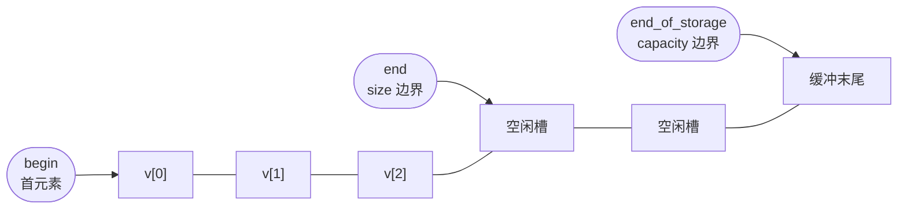
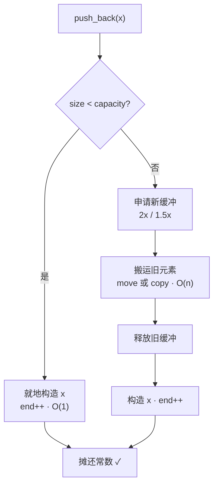
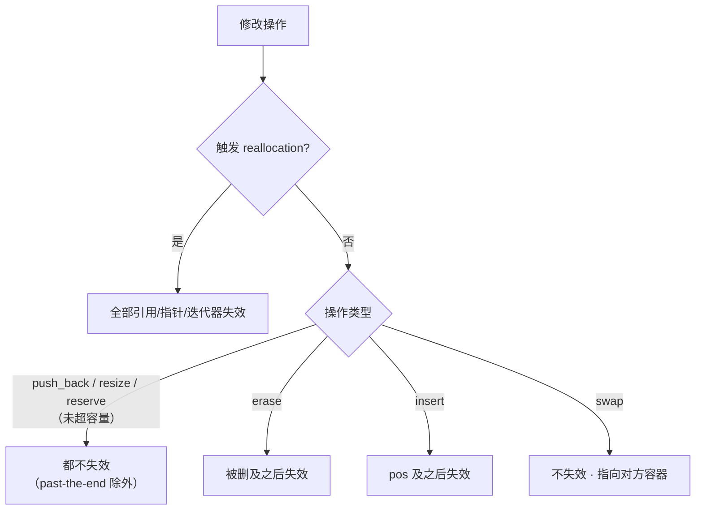

# Vector Deep Dive: Three Pointers, Reallocation, and Iterator Invalidation

In this article, we will take a deep dive into the implementation details of `std::vector`.

In Volume One, we have comfortably used `vector` as a "self-growing array," utilizing `push_back`, `size()`, `capacity()`, and `reserve()` with ease. However, there is a difference between using it fluently and truly understanding it. Have you ever encountered these bizarre situations: a loop with continuous `push_back` runs incredibly fast most of the time, but inexplicably stutters on a specific iteration; or you carefully cache an iterator or a pointer, only to find it pointing to garbage one day; or perhaps your supposedly strong exception safety is silently undermined by a reallocation.

These pitfalls are rooted in the implementation layer of `vector`. Therefore, instead of repeating how to call the APIs covered in Volume One (which you surely know by now), we will break down `vector` into three pointers, a growth strategy, and a set of invalidation rules. We will also look at the two new doors C++20 has opened—`constexpr` and `erase/erase_if`.

------

## Three Pointers Hold Up the Entire Vector

In mainstream standard library implementations (libstdc++, libc++, MSVC STL), the body of a `vector` essentially consists of three pointers. It is not an array, nor a linked list, but rather: `begin` points to the first element, `end` points to the position "after" the last valid element, and `end_of_storage` points to the end of the allocated buffer. (I recall there was a question regarding this on Zhihu, and mainstream implementations indeed follow this pattern.)



Once you grasp this diagram, everything clicks: `size()` is simply `end - begin`, `capacity()` is `end_of_storage - begin`, and `capacity() - size()` tells you exactly how many elements you can insert before triggering a reallocation. The standard doesn't strictly mandate this specific three-pointer implementation (it only requires contiguous storage and specific interface behaviors), but once you know the underlying structure is just these three pointers, all the other characteristics make perfect sense:

1. Reallocation is simply moving the chunk `[begin, end)` to a new buffer.
2. Iterator invalidation is simply the result of the buffer being swapped out.
3. `data()` can be passed directly to C APIs because `begin` points to a single contiguous block of raw memory.

## Reallocation: Amortized Constant Time, but Individual Steps Can Be O(n)

So, what happens when we `push_back` into a `vector` where `capacity` is already full? It triggers a *reallocation*—allocating a new buffer, moving the old elements over, and freeing the old buffer. The standard guarantees **amortized constant time complexity** for `push_back`. It is crucial to latch onto the word "amortized"; it does not mean "constant."

This is often misread as "every `push_back` is O(1)," leading some developers to confidently place `push_back` inside hot loops. The result is that one specific reallocation becomes an O(n) move operation, causing a sharp spike in the performance curve. Why does amortized analysis hold? The key is that during reallocation, the capacity grows by a geometric factor (greater than 1). This spreads the cost of that one expensive move operation across the preceding sequence of cheap `push_back` calls.

(PS: The author has been extremely busy lately. If you find this topic interesting, try running a profiler locally!)



So, what exactly is this growth factor? Well, the **Standard doesn't specify** (strictly speaking, it is *unspecified*, which is even looser than *implementation-defined*, as the latter at least requires the implementation to document it). Consequently, the three major implementations made their own choices: both libstdc++ and libc++ use approximately 2× (their formulas are `size()+max(size(),n)` and `max(2*capacity(),n)` respectively), while MSVC STL uses 1.5× (`capacity()+capacity()/2`). If you don't believe it, try `push_back`ing 16 elements and printing `capacity()` yourself—libstdc++/libc++ follow the sequence `0 → 1 → 2 → 4 → 8 → 16 → 32`, while MSVC follows `0 → 1 → 2 → 3 → 4 → 6 → 9 → 13 → 19`.

MSVC didn't choose 1.5× arbitrarily. When the growth factor is strictly less than 2, the free blocks released earlier can potentially be reused by later allocations—mathematically speaking

$$\sum_{i=0}^{k-1} 1.5^i = 2(1.5^k - 1) > 1.5^k$$

This means that if a previously freed block is large enough to satisfy the current request, the allocator can reuse it. This reduces fragmentation and keeps the RSS (Resident Set Size) from staying too high. With strict 2× growth, however, $\sum_{i=0}^{k-1} 2^i = 2^k - 1 < 2^k$. No previously freed block can ever hold the current request, so reuse is impossible. There is a trade-off, of course: 1.5× growth involves more moving of elements. This is a trade-off between "memory reuse" and "number of moves," and each approach has its own calculation. (There is a minor edge case: the very first `push_back` jumps capacity from 0 to 1. This is consistent across all three implementations and is simply a special case of "starting from 0," so don't use this example to verify the 2×/1.5× rules.)

> ⚠️ Let me reiterate: when discussing performance conclusions, please use "amortized constant time" instead of just "constant time" for brevity. The single `push_back` that triggers reallocation is genuinely O(n).

## Iterator Invalidation: All the Rules in One Table

Perhaps no container causes more "iterator invalidation" pitfalls than `vector`—you store an iterator or a pointer, perform an operation, and it silently becomes a dangling pointer. The rules can actually be summarized in a single table:

| Operation | When Invalidated | Scope of Invalidation |
|------|---------|---------|
| `push_back` / `emplace_back` | Only when reallocation is triggered | **All** if triggered; **none** if not triggered (space remains) |
| `reserve(n)` | When `n > current capacity()` triggers reallocation | All if triggered; otherwise none |
| `shrink_to_fit` | If reallocation occurs | All |
| `resize(n)` | `n > capacity()` triggers reallocation | All if triggered; otherwise references/pointers remain valid, only past-the-end iterators are invalidated |
| `erase(p)` / `erase(first, last)` | Always | **Erased elements and all after them** |
| `insert` / `emplace` | If reallocation occurs | All if triggered; otherwise `pos` and all after it |
| `clear` | Always | All |
| `assign` / `assign_range` | Always | All |
| `swap` | —— | **None**: iterators/pointers/references remain valid, but they now refer to elements in the "other" container |

Find the table too dense? Compress it into a decision tree to make it easier to remember:



The one in the table that is easiest to mix up is the last entry, `swap`. It does not invalidate—what you swap away is the content inside the container, but the iterator remains pinned to that original memory address. Consequently, it now points to the container that was swapped in. Once you understand this, you will see why some libraries love to write code like `vector<T>().swap(v)` to "truly release" memory: it swaps in an empty temporary object, taking the original buffer along with its capacity to be destructed, leaving nothing behind.

## `move_if_noexcept` during Reallocation

The strong exception guarantee requires that an operation either succeeds completely or leaves the state unchanged. When `push_back` triggers a reallocation, it must move old elements to a new buffer one by one. This step is a potential point where an exception might be thrown. To achieve "rollback if moving halfway fails," the standard library makes a critical judgment on each element during reallocation: **if the element's move constructor is `noexcept`, move; otherwise, fall back to copying.**

The basis for this decision is `std::is_nothrow_move_constructible_v<T>`. In other words—if you wrote a move constructor for your type but didn't mark it `noexcept`, `vector` will get nervous during reallocation and prefer the slower copy path. Why? If a copy fails, the old buffer is still intact and can be used for rollback. If a move fails, the source elements might have already been gutted, making recovery impossible. Therefore, my advice is simple: if you can add `noexcept` to a move constructor, definitely do it. It directly determines whether reallocation is a "move" or a "copy" inside `vector`. The standard library specifically provides a `std::move_if_noexcept` tool for this, though its real stage is precisely this kind of internal container logic where "exception safety dictates a choice between move and copy."

## Two New Doors C++20 Opened for `vector`

### One is `constexpr vector`

C++20 finally enabled `vector` to be used at compile time. Behind this are two proposals working in tandem: **P0784R7** "More constexpr containers" first laid the groundwork—`constexpr` `new`/`delete`, `std::construct_at`/`std::destroy_at`, plus a model called *transient constexpr allocation*; **P1004R2** "Making std::vector constexpr" then built on this mechanism to mark `vector`'s (and `string`'s) member functions as `constexpr`. To check for support, look for the feature macro `__cpp_lib_constexpr_vector`.

There is a limitation here that **must be made clear**: the transient allocation model requires that *memory allocated during constant evaluation must be released before the end of that same constant evaluation*, otherwise the program is ill-formed. In plain English—you cannot define a persistent `constexpr std::vector` variable and "carry" its buffer of heap objects out of compile time into runtime. So, how do we actually use `vector` at compile time? The correct approach is: inside a `constexpr` function, create it temporarily, perform a series of operations, and finally **return only a scalar result** (sum of elements, element count, or a specific element value), allowing the buffer to destruct before the function returns. This fits embedded systems and lookup table scenarios perfectly—use `vector` at compile time as a temporary workspace to calculate a constant, then move the result into a `std::array` or `constexpr` variable, saving all runtime initialization costs.

### The Other is `erase` / `erase_if`

In old C++, to remove all elements satisfying a condition from a `vector`, you had to hand-write the famous erase-remove idiom: `v.erase(std::remove_if(v.begin(), v.end(), pred), v.end());`. It's long and error-prone—I've seen accident scenes where people forgot the second `v.end()` or the outer `erase`. C++20 corralled this mess with a pair of free functions: `std::erase(v, value)` removes all elements equal to `value`, and `std::erase_if(v, pred)` removes all satisfying the predicate. Both return the number of elements removed.

These functions come from proposal **P1209R0**, titled "Adopt Consistent Container Erasure from Library Fundamentals 2 for C++20"—the title tells you the intent: to formally bring the unified erasure API, originally in the Library Fundamentals TS, into C++20. cppreference has a crisp definition for them: they *"erase all elements that compare equal to value / satisfy the predicate from the container"*, replacing that error-prone erase-remove idiom. Don't get this detail mixed up: sequence containers (`vector`, `deque`, `list`, `forward_list`, `string`) get both `erase` and `erase_if`, while associative/unordered associative containers only get `erase_if`—because their member `erase(key)` already handles "delete by key," so adding another `erase(c, value)` would cause semantic conflicts. Check for support via `__cpp_lib_erase_if` (C++20, value `202002`).

------

## Let's Run It

Talk is cheap. The following sections are marked with platform and standard, and can be compiled standalone. We will run through the concepts discussed above one by one.

First, observing reallocation. We print a line every time the capacity changes, so you can intuitively see whether your implementation uses 2× or 1.5× growth.

```cpp
// Standard: C++17  | Platform: host
#include <iostream>
#include <vector>

void trace_growth(std::vector<int>& v, int value)
{
    std::size_t cap_before = v.capacity();
    v.push_back(value);
    if (v.capacity() != cap_before) {
        std::cout << "push " << value << ": size=" << v.size()
                  << " capacity " << cap_before << " -> " << v.capacity() << '\n';
    }
}

int main()
{
    std::vector<int> v;
    for (int i = 0; i < 17; ++i) {
        trace_growth(v, i);
    }
    return 0;
}
```

Second, we compare the two scenarios of iterator invalidation. `push_back` does not invalidate iterators while spare capacity remains, but triggers a full invalidation once reallocation occurs; `reserve`, on the other hand, inevitably swaps the buffer once the current capacity is exceeded.

```cpp
// Standard: C++17  | Platform: host
#include <iostream>
#include <vector>

int main()
{
    std::vector<int> v{1, 2, 3};
    v.reserve(3);  // 预留：当前已有 3，不触发扩容

    const int* p = &v[1];
    v.push_back(4);  // 还有 1 个余量，不扩容
    std::cout << "no realloc, p valid? " << (p == &v[1]) << '\n';  // 1

    v.reserve(100);  // 超过 capacity，必然换缓冲
    std::cout << "after reserve, p valid? " << (p == &v[1]) << '\n';  // 0，已失效
    return 0;
}
```

Third, `move_if_noexcept`. For a type with a move constructor marked as `noexcept`, we use move during reallocation; otherwise, we fall back to copy.

```cpp
// Standard: C++17  | Platform: host
#include <iostream>
#include <vector>

class Tracked {
public:
    int id;
    static int move_count;
    static int copy_count;

    explicit Tracked(int i) : id(i) {}
    Tracked(const Tracked& o) : id(o.id) { ++copy_count; }
    // 故意不标 noexcept：扩容时不放心，退回 copy
    Tracked(Tracked&& o) noexcept(false) : id(o.id) { ++move_count; }
};
int Tracked::move_count = 0;
int Tracked::copy_count = 0;

int main()
{
    std::vector<Tracked> v;
    v.reserve(2);
    v.emplace_back(1);
    v.emplace_back(2);
    v.emplace_back(3);  // 触发扩容

    std::cout << "moves=" << Tracked::move_count
              << " copies=" << Tracked::copy_count << '\n';
    // 未标 noexcept 时多半走 copy；把 noexcept(false) 改成 noexcept 再跑，会变成 move
    return 0;
}
```

Fourth, `constexpr vector`. We use it as a temporary workspace at compile time, and only bring out the scalar results.

```cpp
// Standard: C++20  | Platform: host
#include <vector>

constexpr int sum_first_n(int n)
{
    std::vector<int> v;
    for (int i = 0; i < n; ++i) {
        v.push_back(i + 1);  // 常量求值期分配，函数返回前必须释放
    }
    int sum = 0;
    for (int x : v) {
        sum += x;
    }
    return sum;  // 只返回标量，缓冲在函数内自然析构
}

static_assert(sum_first_n(100) == 5050);  // 全程编译期完成

int main() { return 0; }
```

Fifth, `erase_if`, which handles erase-remove in a single line.

```cpp
// Standard: C++20  | Platform: host
#include <iostream>
#include <vector>

int main()
{
    std::vector<int> v{1, 2, 3, 4, 5, 6};
    std::size_t removed = std::erase_if(v, [](int x) { return x % 2 == 0; });
    std::cout << "removed " << removed << ", left:";
    for (int x : v) {
        std::cout << ' ' << x;
    }
    std::cout << '\n';  // removed 3, left: 1 3 5
    return 0;
}
```

Of course, feel free to click this to see the behavior in action!

<OnlineCompilerDemo
  title="vector Implementation Deep Dive: Reallocation, Invalidation, constexpr, erase_if"
  source-path="code/examples/vol3/03_vector_deep_dive.cpp"
  description="Observe vector capacity jumps, iterator invalidation, move_if_noexcept, and C++20 constexpr/erase_if"
  allow-run
  allow-x86-asm
/>

------

## Wrapping Up

Translating the previous concepts into engineering practice, my advice boils down to a few key points. First, **`reserve` whenever you can estimate the scale**—immediately after constructing a `vector`, call `reserve` with the known or estimated final size. This collapses multiple reallocations into a single allocation, which yields immediate results on hot paths. Second, **use `erase_if` for deletion**; stop hand-writing the erase-remove idiom. It is shorter and less prone to forgetting the `v.end()` iterator. Third, **use `vector` as a temporary buffer for compile-time table generation**. Calculate the data, then pass only the scalar results to `static_assert` or store them in `constexpr` variables. This allows us to comfortably enjoy the dynamic capabilities of transient allocation at compile time without crossing the line.

Finally, here are a few key takeaways: a `vector` essentially consists of three pointers `{begin, end, end_of_storage}`, where `size` and `capacity` are derived from them; `push_back` has amortized constant complexity, not constant complexity, and the growth factor is not specified by the standard (libstdc++/libc++ use 2×, MSVC uses 1.5×); the rules for invalidation boil down to one table—reallocation operations "invalidate all on trigger," `erase` "invalidates the erased element and those after it," and `swap` "invalidates nothing"; whether elements are moved during reallocation depends on whether the move constructor is marked `noexcept`; C++20 makes `vector` `constexpr` (P0784R7 + P1004R2), but limited by transient allocation, it can only serve as a compile-time temporary buffer; in the same year, `erase`/`erase_if` (P1209R0) replaced the erase-remove idiom for you. Keep these in your pocket, and you will avoid most `vector` pitfalls.

------

## References

- [std::vector — cppreference](https://en.cppreference.com/w/cpp/container/vector)
- [vector::capacity — cppreference](https://en.cppreference.com/w/cpp/container/vector/capacity)
- [vector::push_back — cppreference](https://en.cppreference.com/w/cpp/container/vector/push_back)
- [std::erase / std::erase_if (vector) — cppreference](https://en.cppreference.com/w/cpp/container/vector/erase2)
- [vector.capacity — eel.is/c++draft](https://eel.is/c++draft/vector.capacity) · [sequence.reqmts — eel.is/c++draft](https://eel.is/c++draft/sequence.reqmts)
- [P0784R7 More constexpr containers](https://www.open-std.org/jtc1/sc22/wg21/docs/papers/2019/p0784r7.html)
- [P1004R2 Making std::vector constexpr](https://www.open-std.org/jtc1/sc22/wg21/docs/papers/2019/p1004r2.pdf)
- [P1209R0 Adopt Consistent Container Erasure from Library Fundamentals 2 for C++20](https://www.open-std.org/jtc1/sc22/wg21/docs/papers/2018/p1209r0.html)
