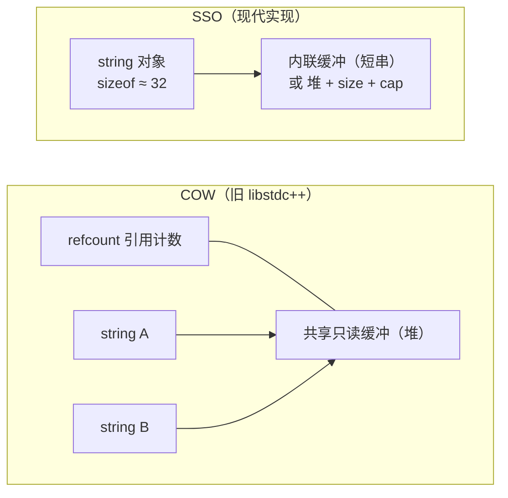
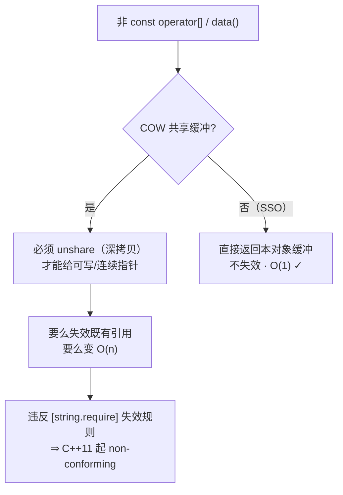

# Deep Dive into std::string: SSO, COW, and resize_and_overwrite

`std::string` is likely the most overworked yet least understood type in the standard library. We happily write `std::string s = "hello";` all day long, but when pressed—*"Why is `sizeof(std::string)` 32 on my machine?"*, *"Why do two strings in this old code share the same buffer?"*, *"What exactly does C++23's `resize_and_overwrite` save us?"*—most of us are stumped. The roots of these questions lie entirely in `string`'s memory model and its long history.

In this article, we will focus specifically on the thread of `string` memory and buffers: the historical entanglement of SSO and COW, the implementation thresholds of SSO, and the buffer reuse API `resize_and_overwrite` brought to us by C++23. (C++20's `char8_t` is a separate topic, covered in Volume III: [char8_t and UTF-8 Strings](../strings/30-char8-t-utf8.md).)

------

## SSO and COW: An ABI History

To understand why `string` looks the way it does today, we have to turn the clock back to C++03. Back then, there was a particularly attractive implementation strategy—**Copy-On-Write (COW)**. When you wrote `string b = a;`, it didn't actually copy the characters. Instead, it let `b` and `a` share the same read-only buffer, only maintaining an additional reference count. It wasn't until one side actually needed to write that it performed a deep copy. In scenarios involving many copies of read-only strings, this saved a significant amount of memory and time. Early versions of libstdc++ (GCC's C++ Standard Library) were staunch proponents of COW.



However, the C++11 standard effectively ruled Copy-on-Write (COW) "illegal". Proposal **N2668**, "Concurrency Modifications to Basic String", rewrote the invalidation rules in `[string.require]` and the semantics of `data()`/`c_str()`. The original text states unequivocally: *"This change effectively disallows copy-on-write implementations."* So, what is the fundamental legal reasoning? I must remind you: many assume it is "thread safety" or "`noexcept`", but those are merely side issues that amplified the conflict. The real verdict comes down to the intersection of these three rules:

- **Invalidation rules**: `[string.require]` dictates that calling element access methods like `operator[]`, `at`, `front`, `back`, `begin/end`, as well as `data()` itself, must not invalidate existing references and iterators.
- **Contiguous null-terminated `data()`/`c_str()`**: These methods must return a pointer to a contiguous, null-terminated array belonging to this object.
- **Non-const access requires a writable pointer**: Once you obtain a non-const handle via `s[0]` or `s.data()`, COW is forced to *unshare* (deep copy) the shared buffer to provide you with an exclusive, contiguous, writable pointer.



You see, COW tried to simultaneously embrace "sharing", "non-invalidating references", "O(1)", and "contiguous null-terminated", which is inherently contradictory. The standard decisively chose the latter three, leaving COW as non-conforming. In reality, the transition was even bumpier: due to ABI compatibility baggage, libstdc++ held out until **GCC 5 (2015)** to switch to a non-COW implementation via the `_GLIBCXX_USE_CXX11_ABI` switch (the new inline symbols are named `std::__cxx11::basic_string`); meanwhile, libc++ and MSVC's Dinkumware implementation were SSO from the get-go, completely avoiding this historical debt.

## The SSO Threshold: Why `sizeof` is 32

With COW out of the picture, mainstream implementations uniformly shifted to **SSO (Small String Optimization)**: reserving a small inline buffer inside the `string` object. Strings short enough to fit in this buffer avoid heap allocation and are stored directly within the object itself. This also answers the question "why is `sizeof(std::string)` 32?"—the object must simultaneously accommodate the inline buffer, heap pointer, size, and capacity fields. Mainstream implementations typically pack all of this into about 32 bytes.

I must mention: the SSO threshold is an **implementation detail; the standard never specifies it** (it falls under QoI, Quality of Implementation). In mainstream implementations, libstdc++, libc++, and MSVC STL generally have a threshold around 15 bytes (libc++ also has a layout variant with 22 bytes). These numbers are not promises and may vary across implementations or versions—so, mark my words—**don't treat the threshold as a hard guarantee in your code**. It might be 15 today, but change a compiler tomorrow and it won't be.

## `resize_and_overwrite`: C++23 Finally Lets You Use `string` as a Buffer

C++23 added a quite handy member to `string`—`resize_and_overwrite`, proposed in **P1072R10** "basic_string::resize_and_overwrite". Its most typical use case is treating `string` as a writable buffer to interface with C APIs that "write some data, then tell you how much was written" (like `read`, `fread`, `getenv`, and that ilk).

The signature looks like this: `template<class Operation> constexpr void resize_and_overwrite(size_type count, Operation op);`. It first ensures the string capacity is at least `count`, then passes a pointer `p` (to the first character of contiguous storage) and that `count` to the callback `op`. `op` writes the actual content in-place and **returns an integer r as the new length** (requiring `r ∈ [0, count]`). What's the benefit? Unlike `resize(count)`, it **does not** value-initialize (zero out) the newly added range, saving an unnecessary write; you only write the bytes you need in the callback, then report the actual length.

Freedom comes at a price. `resize_and_overwrite` has a few UB red lines to watch closely: `op` must return an integer within `[0, count]`; going out of bounds is undefined behavior (UB). `op` throwing an exception is UB (so `op` is usually marked `noexcept`). `op` cannot modify the `p` or `count` parameters themselves. Finally, every character in the retained range `[p, p+r)` must be a definite value written by `op`; no indeterminate values are allowed. There's also an easily overlooked point—regardless of whether this call triggers reallocation, it invalidates all iterators, pointers, and references. To detect support, check for `__cpp_lib_string_resize_and_overwrite` (C++23, value `202110L`).

------

## Let's Run It

First, let's look at SSO. Print out `sizeof(std::string)` and check whether the `data()` address of short and long strings actually lands inside the object.

```cpp
// Standard: C++17  | Platform: host
#include <iostream>
#include <string>

bool points_inside_object(const std::string& s)
{
    const char* obj = reinterpret_cast<const char*>(&s);
    return s.data() >= obj && s.data() < obj + sizeof(std::string);
}

int main()
{
    std::cout << "sizeof(std::string) = " << sizeof(std::string) << '\n';

    std::string short_s = "hi";       // 很可能走 SSO
    std::string long_s(64, 'x');      // 超过 SSO 阈值，出堆

    std::cout << "short_s.data() in object? " << points_inside_object(short_s) << '\n';  // 多半是 1
    std::cout << "long_s.data()  in object? " << points_inside_object(long_s) << '\n';   // 多半是 0
    return 0;
}
```

Let's look at the comparison between `resize_and_overwrite` and the traditional `resize``. Here, we have created a "simulated C API" that writes fixed content to a buffer and returns the actual number of bytes written, making the differences between the two approaches immediately obvious.

```cpp
// Standard: C++23  | Platform: host
#include <algorithm>
#include <cstring>
#include <iostream>
#include <string>

// 模拟一个 C API：向 buf 最多写 n 字节，返回实际写入数
std::size_t fake_read(char* buf, std::size_t n)
{
    static const char msg[] = "hello";
    std::size_t len = std::min(n, sizeof(msg) - 1);
    std::memcpy(buf, msg, len);
    return len;
}

int main()
{
    // 旧写法：resize(64) 先把 64 个字符全部值初始化（清零），再被覆盖
    std::string old_buf;
    old_buf.resize(64);
    std::size_t got = fake_read(old_buf.data(), old_buf.size());
    old_buf.resize(got);  // 再截回实际长度
    std::cout << "old: '" << old_buf << "' (len=" << old_buf.size() << ")\n";

    // C++23：resize_and_overwrite 不清零多余字符，回调报告实际长度
    std::string buf;
    buf.resize_and_overwrite(64, [](char* p, std::size_t n) noexcept {
        return fake_read(p, n);  // 只写实际字节，返回新长度
    });
    std::cout << "new: '" << buf << "' (len=" << buf.size() << ")\n";
    return 0;
}
```

<OnlineCompilerDemo
  title="Deep Dive into string Memory: SSO Observation and resize_and_overwrite"
  source-path="code/examples/vol3/04_string_memory.cpp"
  description="Observe the sizeof of std::string and SSO behavior, comparing buffer reuse between resize() and C++23 resize_and_overwrite"
  run-options="-std=c++23"
  allow-run
  allow-x86-asm
/>

------

## References

- [std::basic_string — cppreference](https://en.cppreference.com/w/cpp/string/basic_string)
- [basic_string::data — cppreference](https://en.cppreference.com/w/cpp/string/basic_string/data)
- [basic_string::resize_and_overwrite — cppreference](https://en.cppreference.com/w/cpp/string/basic_string/resize_and_overwrite)
- [N2668 Concurrency Modifications to Basic String](https://www.open-std.org/jtc1/sc22/wg21/docs/papers/2008/n2668.htm)
- [P1072R10 basic_string::resize_and_overwrite](https://www.open-std.org/jtc1/sc22/wg21/docs/papers/2021/p1072r10.html)
