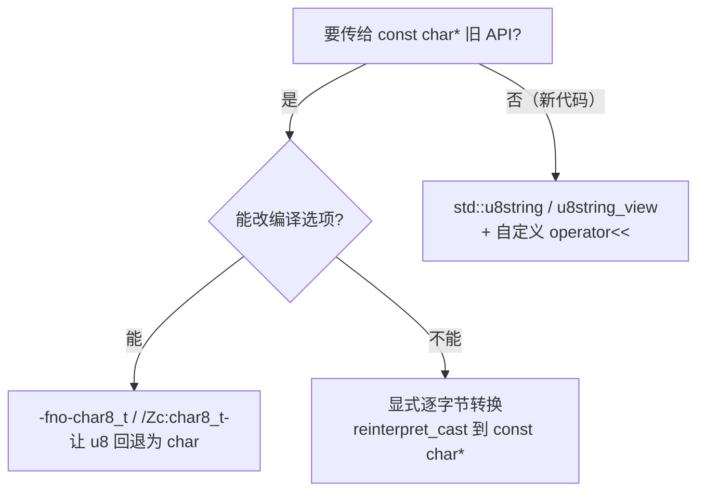

# char8_t and UTF-8 Strings

Before C++20, the type of the UTF-8 string literal `u8"..."` was `const char[N]`—indistinguishable from ordinary strings at the type level. This might sound trivial, but it is actually a breeding ground for pitfalls: you cannot distinguish at the type level between "this string is UTF-8" and "this string is the native execution character set," and the compiler cannot prevent you from mistakenly treating UTF-8 as raw bytes and printing garbage. C++20 introduced `char8_t` to separate UTF-8 from the ambiguous realm of `char`, giving it a dedicated type and letting the type system do the gatekeeping for us. This change comes from proposal **P0482R6**, "char8_t: A type for UTF-8 characters and strings," and feature detection can be done via `__cpp_char8_t` (C++20, value `201811L`).

However—I must issue a heads-up in advance—this "independent type" change is **breaking**: it alters the type of `u8` literals, causing a significant amount of legacy code that compiled peacefully under C++17 to fail under C++20. In this article, we will clearly explain the two most common pitfalls, how to migrate code, and the fix that C++23 applied later on.

## The Soul of the `u8` Literal Type Has Changed

Starting with C++20, the type of the UTF-8 string literal `u8"..."` changed from `const char[N]` to `const char8_t[N]`; similarly, the type of the UTF-8 character literal `u8'c'` changed from `char` to `char8_t`. This `char8_t` is a distinct **fundamental type** whose underlying type is `unsigned char`, with the same size, alignment, and conversion rank as `unsigned char`—but it **does not participate in aliasing rules** (it is not one of the types allowed to alias access objects in [basic.lval]). This means you cannot legally use a `char8_t*` to alias access the memory of other objects.

Why go to such lengths to create a separate type? The logic is simple: once types are distinct, the compiler can directly report errors when you "mistakenly use a UTF-8 string as a native `char` string" or "print a `char8_t` as an integer," rather than waiting for runtime to output a screen full of garbage before you realize your mistake. C++20 decided that trading a bit of migration cost for type safety is a good deal.

## Two Classic Pitfalls

Once the type changes, two migration pitfalls surface.

**The first pitfall: `u8""` can no longer implicitly convert to `const char*`.** In C++17, `const char* p = u8"text";` was perfectly legal (back then `char` and `char8_t` were essentially the same); in C++20, `u8"text"` becomes `const char8_t[N]`, and since `char8_t` does not implicitly convert to `char`, this line is ill-formed. All old code that fed `u8` literals to interfaces expecting `const char*` (constructing `std::string`, passing to C APIs, certain overloads of `std::filesystem::u8path`, etc.) is affected.

**The second pitfall: the Standard Library intentionally `=delete`d `char8_t` `ostream` overloads.** You might think—then I'll just `std::cout << u8"text";`? That won't work either. Starting with C++20, the Standard Library **explicitly deletes** the `operator<<` overloads for `char8_t` and `const char8_t*` (UTF-8 characters/strings) on `basic_ostream<char>` and `basic_ostream<wchar_t>` (note: this isn't an "omitted implementation," it is intentional). Consequently, `std::cout << u8'z'` and `std::cout << u8"text"` will fail to compile because they hit the deleted overload. This is done specifically to stop legacy code from printing UTF-8 data as integers or pointers.

## How to Migrate Old Code

When you hit these pitfalls, how do you move C++17 code to C++20? Here are a few paths, listed from lowest to highest cost:



The easiest approach is **compiler flag fallback**: add `-fno-char8_t` for GCC/Clang or `/Zc:char8_t-` for MSVC to revert the type of `u8` literals back to the C++17 `char` semantics. This makes old code compile immediately. However, this is just a stopgap measure for the transition period; new code should not rely on it long-term. The next approach is **explicit byte-by-byte conversion**: when you truly need to feed data to an interface that only accepts `const char*` and you are certain the content is UTF-8 bytes, use `reinterpret_cast<const char*>(u8"text")` (or a C-style cast) to change the perspective. The byte content remains unchanged, only the pointer type is swapped, allowing you to bypass "the first pitfall." The most "politically correct" approach is **to follow the `std::u8string` path**: use `u8string`/`u8string_view` to safely hold UTF-8 text, and write a small `operator<<` to convert it when printing, maintaining type safety to the end.

## C++23's P2513: A Partial Restoration

The scope of "cannot initialize" in "the first pitfall" was later narrowed slightly. Proposal **P2513R4**, "char8_t Compatibility and Portability," adopted as a C++20 Defect Report (DR) and landed in C++23 (changing the value of `__cpp_char8_t` to `202207L`), **re-allows using `u8` string literals to initialize `char` or `unsigned char` arrays**. This means `char ca[] = u8"text";` is legal again. However, note that this only relaxes the "array initialization" rule. The implicit conversion from `const char8_t*` to `const char*` **remains ill-formed** to this day. The pointer assignment scenario in pitfall one was not pardoned.

------

## Try It Out

The following demo places the two pitfalls (which I have "sealed" with comments—uncomment them to trigger immediate compilation failures) alongside two correct approaches for easy comparison.

```cpp
// Standard: C++20  | Platform: host
#include <iostream>
#include <string>

// —— 坑一（取消注释会编译失败）：u8"" 不再隐式转 const char* ——
// const char* p = u8"text";   // ill-formed since C++20

// —— 坑二（取消注释会编译失败）：ostream 显式 =delete 了 char8_t 重载 ——
// std::cout << u8"text";      // ill-formed since C++20
// std::cout << u8'z';         // ill-formed since C++20

// 正确写法之一：显式逐字节转换（内容不变，仅切换指针类型视角）
void print_as_char(const char* s)
{
    std::cout << s << '\n';
}

// 正确写法之二：用 std::u8string 类型安全地持有 UTF-8，并自定义打印
std::ostream& operator<<(std::ostream& os, const std::u8string& s)
{
    return os << reinterpret_cast<const char*>(s.data());
}

int main()
{
    // 路线 A：把 u8 字面量当 const char* 用（适合喂给只认窄字符的旧接口）
    print_as_char(reinterpret_cast<const char*>(u8"text"));

    // 路线 B：u8string 全程保持 UTF-8 类型，打印时再转
    std::u8string u8s = u8"UTF-8 text";
    std::cout << u8s << '\n';
    return 0;
}
```

<OnlineCompilerDemo
  title="char8_t and UTF-8 Strings: Two Pitfalls and Correct Usage"
  source-path="code/examples/vol3/14_char8_t.cpp"
  description="Demonstrates two compilation failure pitfalls caused by C++20 u8 literal type changes, and two correct approaches using explicit casting and u8string"
  allow-run
  allow-x86-asm
/>

------

## References

- [char8_t — cppreference](https://en.cppreference.com/w/cpp/keyword/char8_t)
- [String literal — cppreference](https://en.cppreference.com/w/cpp/language/string_literal)
- [operator<<(basic_ostream) — cppreference](https://en.cppreference.com/w/cpp/io/basic_ostream/operator_ltlt2)
- [P0482R6 char8_t: A type for UTF-8 characters and strings](https://www.open-std.org/jtc1/sc22/wg21/docs/papers/2018/p0482r6.html)
- [P2513R4 char8_t Compatibility and Portability](https://www.open-std.org/jtc1/sc22/wg21/docs/papers/2022/p2513r4.html)
