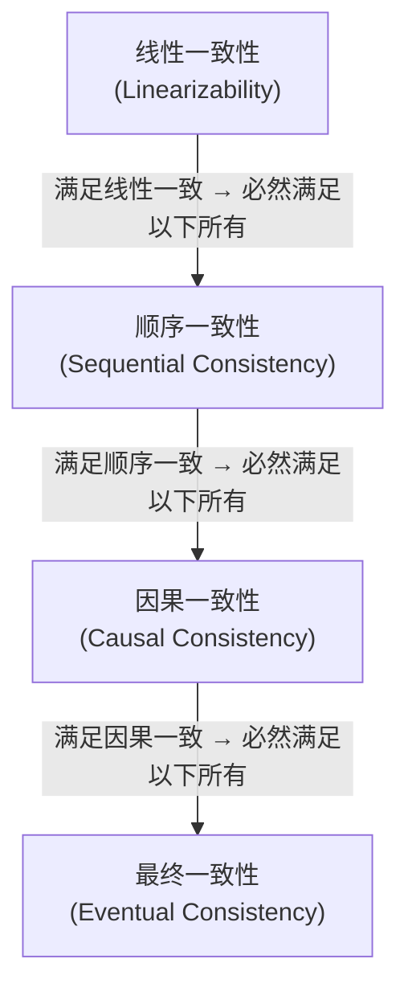

# A First Look at Distributed Consistency Primitives

> ℹ️ **Section Positioning**: Following the previous article, we continue our conceptual overview. The consistency model spectrum discussed here also lacks runnable code. The focus is on helping you build an intuition for "from strong to weak consistency," laying the groundwork for reading distributed systems papers and practical implementation in Volume 8.

In the previous article, we explored the five fundamental differences between single-machine concurrency and distributed systems, understanding facts like "networks are unreliable, clocks are inaccurate, and partial failures are inevitable." Honestly, I was quite shocked when I first encountered distributed consistency—on a single machine, consistency is almost "free" (costing only a few nanoseconds for lock/unlock), but in a distributed environment, it becomes something you must exchange for paper-level protocols, multiple rounds of network communication, and majority voting. In this article, we face this core challenge—**consistency**.

Let's establish an intuition first: when a piece of data has replicas on multiple machines, do clients reading from different replicas see the same value? When do they see the latest value? How much data divergence exists between replicas? The answers to these questions depend on the consistency model the system chooses. Consistency models are not binary (either consistent or inconsistent); rather, they form a spectrum from strong to weak—understanding this spectrum is fundamental to understanding distributed systems and is the core thread of this article.

## The Consistency Model Spectrum

Our goal now is to establish this spectrum using four consistency models, ranging from strong to weak. For each model, we will explain it using a concrete scenario rather than just throwing out a definition—understanding "why we need this model" is far more important than memorizing "how this model is defined."

### Linearizability: The Strongest Guarantee

We start with the strongest. Linearizability, also known as strong consistency or atomic consistency, implies that every operation appears to occur atomically at some **unique point in time** between its invocation and completion, and these points form a total order. Simply put—if we treat the distributed system as a black box, from an external observer's perspective, all operations happen just as if they were on a single machine. This is similar to the `memory_order_seq_cst` we discussed in ch03: the strongest memory order on a single machine guarantees all threads see a consistent operation order, while linearizability is the equivalent guarantee in a distributed environment.

Let's use a bank transfer scenario to illustrate. Suppose you and your roommate share an account with a balance of 1000 yuan. You transfer 800 yuan out via a mobile app, and at that exact moment, your roommate checks the balance at an ATM. Under linearizability, your roommate's query can only yield one of two results: either they see 1000 yuan (your transfer hasn't taken effect yet) or they see 200 yuan (your transfer has taken effect). It is impossible for your roommate to see an intermediate state like 500 or 900 yuan.

More critical is the guarantee of time ordering: if you complete the transfer operation first (receiving a "transfer successful" response), and then your roommate initiates a query, your roommate is guaranteed to see 200 yuan—they cannot see an old value. This is the "real-time" property of linearizability: the actual chronological order of operations matches the order presented by the system.

Linearizability is the strongest consistency guarantee, but it is also the most expensive. To implement it, every write operation must wait for confirmation from a majority of replicas before returning success, and every read operation must also query the majority for the latest value (or query a Leader and ensure the Leader hasn't changed). This implies at least one network round trip in terms of latency (usually multiple rounds), and in terms of availability, if a majority cannot be reached, the system must refuse service.

Which systems provide linearizability? ZooKeeper (for writes and synchronous reads), etcd, and Consul, mentioned in the previous article, all provide it. Google Spanner achieves external consistency (even stronger than linearizability) through the TrueTime API mentioned previously, while many relational databases in standalone mode are naturally linearizable.

### Sequential Consistency: Relaxing Time Requirements

Alright, linearizability is the strongest, but also the most expensive. If we relax the requirements slightly—no longer requiring that the actual chronological order of operations matches the order presented by the system, but only requiring that all processes see the same operation order—we get sequential consistency. Specifically, all processes see the same total order of operations, but this order does not have to match the actual physical time of occurrence, as long as each process's own operations maintain the order specified in the program.

Returning to the bank transfer example. Suppose you transfer 800 yuan out on your mobile phone, and then your roommate transfers 500 yuan out at an ATM. Under sequential consistency, the system can present the order "your roommate transfers 500 first, then you transfer 800"—this is the reverse of your physical operation order. But the key is: all observers see the same order. There won't be one person saying "transferred 800 first" and another saying "transferred 500 first."

The difference between sequential consistency and linearizability lies in that "real-time" constraint: linearizability requires the system's presented order to match actual time, while sequential consistency does not. However, both require a globally consistent arrangement of all operations. This difference seems subtle, but it is significant in implementation—linearizability requires some form of global clock or consensus protocol to synchronize time, whereas sequential consistency only needs to guarantee the atomic broadcast order of operations.

### Causal Consistency: Preserving Causality, Not Global Order

If we relax constraints further, no longer requiring a total global order for all operations, but only requiring that **causally related** operations be seen by all processes in the same order, while causally unrelated operations can be seen in different orders—we arrive at causal consistency.

What does "causally related" mean? Simply put, if operation B reads a value written by operation A, then A and B have a causal relationship—A "caused" B. Or if operation C occurs after operation B (within the same process), and B causally depends on A, then C also causally depends on A. Beyond these direct and indirect dependencies, two operations are **concurrent**—there is no causal relationship between them.

Let's use a social media scenario to explain. User Alice posts a message: "The weather is nice today!" (Operation A). User Bob sees Alice's post and replies: "Indeed it is!" (Operation B). Operation B causally depends on Operation A—because Bob replied only after seeing Alice's post. Under causal consistency, any user must see Alice's post first, and then see Bob's reply—it is impossible to see Bob's reply but not Alice's post, as that would make no semantic sense.

At the same time, user Carol also posts a message: "Had hotpot today." (Operation C). Operation C and Operation A are concurrent—there is no causal relationship between them. Under causal consistency, different users can see A and C in different orders: some might see the weather post first then the hotpot post, others might see them in reverse—both are fine, because there is no "who caused who" relationship between them.

Causal consistency is a practical choice for many distributed databases because its implementation cost is much lower than linearizability—you don't need global consensus, you only need to track and propagate causal relationships (usually using vector clocks) to guarantee semantic correctness. Dynamo-style systems (Amazon Dynamo, Apache Cassandra, Riak) provide eventual consistency with causal session guarantees in certain configurations, which is strictly speaking stronger than "pure" eventual consistency but weaker than strict causal consistency.

### Eventual Consistency: Weakest but Fastest

At the bottom of the spectrum is eventual consistency. Its guarantee is very weak: if no new writes occur, eventually ("eventually" is a vague point in time, maybe milliseconds, seconds, or even minutes) all replicas will converge to the same value. Before convergence, different replicas may return different values—you might read the latest write from one replica and an old value from five seconds ago from another.

This guarantee sounds unreliable, but it is sufficient in many scenarios. DNS is a classic example of eventual consistency: when you update a DNS record, it may take minutes or even hours for all DNS servers globally to update—but in most cases, this is perfectly acceptable. Like counts, follower lists, and comment counts on social media—updating this data with a delay of a second or two has no catastrophic consequences.

The advantage of eventual consistency lies in performance and availability: because there is no need to wait synchronously for other replicas, writes can return success immediately, and reads only need to access the local replica. In the event of a network partition, each replica can serve requests independently—maximizing availability.

### Hierarchy of Consistency Models

Great, now let's look at the four models together. They form a hierarchy from strong to weak:



The hierarchy implies that a system satisfying linear consistency also satisfies sequential consistency, causal consistency, and eventual consistency. Conversely, a system satisfying eventual consistency does not necessarily satisfy causal consistency. As we move up each layer, we gain stronger consistency guarantees, but we pay the price of higher latency and reduced availability.

> ⚠️ **Warning**
> In reality, few systems purely implement just one consistency model. I learned this the hard way, assuming a specific database was "eventually consistent," only to discover that under certain configurations, it actually provided stronger consistency guarantees. Many systems offer tunable consistency levels. For instance, Cassandra supports `ONE`, `QUORUM`, and `ALL` read/write consistency levels, which you can choose per operation. `QUORUM` reads and writes ensure you read the latest written value (because the majorities for writes and reads must overlap), but this does not strictly guarantee linear consistency—truly strict linear consistency requires additional mechanisms (like Raft's `ReadIndex` or lease reads). Understanding what guarantees your system provides under specific configurations is far more important than memorizing theoretical definitions.

## Core Ideas of Paxos/Raft

Now that we understand the spectrum of consistency models, a natural question arises: if we need strong consistency (like linear consistency), how do we implement it specifically? The answer is through **consensus protocols**. In the world of distributed systems, the core problem that consensus protocols solve is: getting a group of machines to agree on a value—even if some machines crash or the network partitions. This shares a similar spirit with the atomic operations we discussed in ch03—both are designed to make multiple execution units (threads or machines) reach a consensus on the state of a value. The difference is that atomic operations rely on the CPU's cache coherence protocol, while distributed consensus relies on multiple rounds of network communication and voting.

Let's be clear: we don't intend to provide a complete protocol description of Paxos or Raft here (that would be a paper's worth of work; Lamport's Paxos paper reads like a Greek myth, and while the Raft paper is clear, it's still thirty-some pages). Instead, we focus on the core ideas to help you understand "why it is designed this way."

### Why We Need a Quorum

The cornerstone of a consensus protocol is the **quorum**. Suppose we have $N$ machines. A value needs to be accepted by at least $\lfloor N/2 \rfloor + 1$ machines (a majority) to be considered "committed." Your first reaction might be—why a majority? Why not require everyone to agree?

The core insight is: any two majorities must overlap. If there are 5 machines, a majority is at least 3. No matter how you pick them, any two groups of 3 machines share at least 1 common machine. This overlap implies: if a previous value was accepted by a majority, then any new majority must contain at least one machine that knows about the previous value. As long as the protocol is designed correctly, this "witness" machine can ensure that the new value does not overwrite the committed previous value.

From this insight, tolerating $f$ crashed machines requires at least $2f + 1$ machines. That is, to tolerate 1 crash, you need 3 machines ($3 = 2 \times 1 + 1$); to tolerate 2 crashes, you need 5 machines ($5 = 2 \times 2 + 1$). This is why coordination services like ZooKeeper, etcd, and Consul often recommend deploying 3 or 5 nodes—3 nodes tolerate 1 node failure, and 5 nodes tolerate 2 node failures.

### Leader Election: Who Gives the Orders

Understanding the principle of a quorum, let's look at Raft. Raft's design philosophy can be summarized in one phrase: "understandability first." When designing Raft, Diego Ongaro and John Ousterhout explicitly set "easy to understand" as a goal equal in importance to "correctness." This stands in stark contrast to Paxos, which is "correct but unreadable." Raft decomposes consensus into three sub-problems: leader election, log replication, and safety. Let's start with leader election.

In Raft, there is at most one Leader in the cluster at any time—all write requests are handled by the Leader, and all logs are replicated to Followers by the Leader. This "strong Leader" design is easier to understand and implement than Paxos's "multi-Proposer" model.

Leader election is driven by **terms** and **heartbeats**. Each term is a monotonically increasing integer, and there is at most one Leader per term. Normally, the Leader periodically sends heartbeats to all Followers (`AppendEntries` RPC, even if empty when there are no logs to replicate). If a Follower does not receive a heartbeat within an election timeout, it assumes the Leader is down and starts a new election.

To describe the election process in plain terms: it's "a group of people voting for a leader." The Follower increments the current term, becomes a Candidate, votes for itself first, and then sends `RequestVote` RPCs to all other nodes. The voting rule for other nodes is: at most one vote per term, first-come-first-served (with a restriction: the Candidate's log must be at least as up-to-date as the voter's). If a Candidate receives votes from a majority, it becomes the new Leader and immediately starts sending heartbeats to prevent others from initiating elections.

This process features a clever randomization mechanism: each node's election timeout is randomly chosen within a range. This significantly reduces the probability of multiple nodes initiating elections simultaneously and "splitting the vote"—because their timeouts differ, the node that times out first will usually initiate the election and secure the majority.

### Log Replication: Leader Speaks, Followers Follow

Once a Leader is selected, log replication is straightforward—the core of the process is "Leader says one sentence, Followers repeat it." The client sends a write request to the Leader. The Leader appends the operation to its own log, then replicates this log entry to all Followers (via `AppendEntries` RPC). When the Leader confirms that this log entry has been accepted by a majority (including itself), it **commits** the log, applies it to the state machine, and returns success to the client.

A key safety guarantee is that committed logs are never overwritten. Raft achieves this through a simple constraint: when sending `AppendEntries`, the Leader includes the index and term of the previous log entry. Upon receiving it, the Follower checks if the entry at the corresponding position in its own log matches. If it doesn't match, the Follower rejects the entry. The Leader then backtracks and retries until it finds a position where both sides agree, starting from there to overwrite.

This mechanism ensures that if two log entries have the same term number at the same index position on any Follower, their content must be identical (because a Leader creates only one log entry at a specific index during a term), and all logs preceding that entry are also identical (through recursive matching checks). This is log consistency.

To summarize the entire Raft process with an analogy: imagine a committee (the cluster) where members communicate via letters (network messages). They need to reach agreement on a series of decisions (logs). Raft's approach is to first elect a chairperson (Leader election). The chairperson proposes all decisions (log replication), and decisions take effect only if agreed upon by a majority (quorum voting). If the chairperson loses contact, the committee votes to elect a new chairperson to continue the work. While this analogy is rough, it captures Raft's core design philosophy—the key to consensus is not that "everyone agrees," but that "agreement by a majority is sufficient," and the intersection of majorities guarantees the propagation of information.

## C++ Practice Direction

We've covered enough theory; now let's look at something practical. With the theoretical foundation of distributed consistency in mind, we will explore the direction for writing distributed communication code in C++. To be clear—we won't implement a complete distributed protocol (that's a project in itself; a correct implementation of Raft can take weeks of effort). Instead, we will demonstrate how to use gRPC + C++20 coroutines to build the basic skeleton for communication between distributed services. This leverages the coroutine knowledge we gained in ch06, effectively connecting our previous learnings.

### gRPC Basics: Defining Services with Protobuf

gRPC uses Protocol Buffers (protobuf) to define service interfaces and message formats. This is the key infrastructure in the modern C++ ecosystem that connects "concurrency" and "distribution," as mentioned in the previous article. Suppose we want to implement a simple distributed key-value store service. The proto file would look something like this:

```protobuf
// kv_store.proto
syntax = "proto3";

package kvstore;

// 键值存储服务
service KvStoreService {
    // 获取指定 key 的值
    rpc Get(GetRequest) returns (GetResponse);

    // 设置 key-value
    rpc Put(PutRequest) returns (PutResponse);

    // 删除指定 key
    rpc Delete(DeleteRequest) returns (DeleteResponse);
}

message GetRequest {
    string key = 1;
}

message GetResponse {
    bool found = 1;
    string value = 2;
    int64 version = 3;    // 因果版本号，类似向量时钟的单调版本
}

message PutRequest {
    string key = 1;
    string value = 2;
    int64 expected_version = 3;  // 乐观并发控制：期望的当前版本
}

message PutResponse {
    bool success = 1;
    int64 new_version = 2;
}

message DeleteRequest {
    string key = 1;
}

message DeleteResponse {
    bool success = 1;
}
```

After generating C++ code with the `protoc` compiler, we will get a bunch of `.pb.h` and `.pb.cc` files, plus a `.grpc.pb.h` and `.grpc.pb.cc`—the latter containing the gRPC server base class and client stub code. Don't be intimidated by this pile of generated files; the only things we really need to care about are the base class and the stub class.

### Server Implementation: Handling RPC Requests

Next, let's look at the server implementation—inheriting from the generated `KvStoreService::Service` base class and overriding each RPC method. We use a simple in-memory map as the storage backend, paired with a `std::shared_mutex` for thread safety. If you recall the reader-writer lock pattern discussed in ch02, this is its direct application.

```cpp
// kv_store_server.h
#pragma once

#include <grpcpp/grpcpp.h>
#include "kv_store.grpc.pb.h"

#include <string>
#include <unordered_map>
#include <shared_mutex>
#include <optional>

/// @brief 分布式键值存储的 gRPC 服务端实现
class KvStoreServer final : public kvstore::KvStoreService::Service {
public:
    KvStoreServer() = default;

    /// @brief 处理 Get 请求
    grpc::Status Get(grpc::ServerContext* context,
                     const kvstore::GetRequest* request,
                     kvstore::GetResponse* response) override
    {
        // 读锁：允许多个并发读
        std::shared_lock lock(mutex_);

        auto it = store_.find(request->key());
        if (it == store_.end()) {
            response->set_found(false);
            return grpc::Status::OK;
        }

        response->set_found(true);
        response->set_value(it->second.value);
        response->set_version(it->second.version);
        return grpc::Status::OK;
    }

    /// @brief 处理 Put 请求（带乐观并发控制）
    grpc::Status Put(grpc::ServerContext* context,
                     const kvstore::PutRequest* request,
                     kvstore::PutResponse* response) override
    {
        // 写锁：独占访问
        std::unique_lock lock(mutex_);

        auto it = store_.find(request->key());

        // 乐观并发控制：
        // 如果客户端发送了 expected_version，
        // 检查当前版本是否匹配
        if (request->expected_version() > 0) {
            if (it == store_.end()
                || it->second.version != request->expected_version()) {
                response->set_success(false);
                return grpc::Status::OK;
            }
        }

        int64_t new_version = (it != store_.end())
            ? it->second.version + 1
            : 1;

        store_[request->key()] = {request->value(), new_version};

        response->set_success(true);
        response->set_new_version(new_version);
        return grpc::Status::OK;
    }

    /// @brief 处理 Delete 请求
    grpc::Status Delete(grpc::ServerContext* context,
                        const kvstore::DeleteRequest* request,
                        kvstore::DeleteResponse* response) override
    {
        std::unique_lock lock(mutex_);

        auto erased = store_.erase(request->key());
        response->set_success(erased > 0);
        return grpc::Status::OK;
    }

private:
    struct StoreEntry {
        std::string value;
        int64_t version;
    };

    std::unordered_map<std::string, StoreEntry> store_;
    std::shared_mutex mutex_;    // 读写锁保护 store_
};
```

This code demonstrates several key design points. We use `std::shared_mutex` instead of `std::mutex` to protect storage—read operations (Get) use a shared lock (`std::shared_lock`), while write operations (Put/Delete) use an exclusive lock (`std::unique_lock`). This aligns with the reader-writer lock pattern discussed in ch02: in read-heavy scenarios, shared locks can significantly improve concurrency. Another notable point is the `expected_version` field in the Put request—this implements Optimistic Concurrency Control (OCC). When a client reads a value, it receives its version number. When modifying and writing it back, the client includes this version number. If the server finds that the current version number does not match the client's expectation, it means another party has modified the value, and the write is rejected—the client needs to re-read, re-modify, and re-submit. This is much lighter than using a distributed lock and avoids the various security issues associated with distributed locks that we discussed in the previous article.

The code to start the server is also very concise:

```cpp
// main.cpp（服务端）
#include "kv_store_server.h"

int main()
{
    std::string server_address("0.0.0.0:50051");
    KvStoreServer service;

    grpc::ServerBuilder builder;
    builder.AddListeningPort(
        server_address, grpc::InsecureServerCredentials());
    builder.RegisterService(&service);

    std::unique_ptr<grpc::Server> server(builder.BuildAndStart());
    std::cout << "KvStore 服务端启动，监听: "
              << server_address << "\n";

    server->Wait();
    return 0;
}
```

### Asynchronous gRPC: Wrapping CompletionQueue with Coroutines

So far, we have been using gRPC's **synchronous API**—where every RPC call blocks the current thread until completion. While this works fine for low concurrency, using the synchronous model in high-concurrency scenarios (for example, a server handling thousands of requests simultaneously) causes the number of threads to skyrocket, making context switching the primary bottleneck. This is the same issue we discussed in ch06 regarding "why we need asynchrony."

gRPC provides an asynchronous API centered around `CompletionQueue` (CQ)—an event loop where all asynchronous operations post a completion event to the CQ upon completion. We need a thread to continuously retrieve events from the CQ and process them. This model is very similar to the asynchronous I/O we discussed in ch06: essentially, it is event-driven + callbacks. However, coding directly with CQ is extremely tedious—you must manually manage the lifecycle of request objects, handle various state transitions, and chain callbacks together. If we wrap the CQ with C++20 coroutines, we can significantly improve code readability. Let's look at a simplified example of a coroutine-based gRPC client call.

```cpp
#pragma once

#include <grpcpp/grpcpp.h>
#include "kv_store.grpc.pb.h"

#include <coroutine>
#include <iostream>
#include <memory>

/// @brief 用于包装 gRPC 异步调用的协程 awaitable
/// 这是一个简化版，展示了核心思路
template<typename ResponseType>
struct GrpcAwaitable {
    grpc::ClientContext context;
    ResponseType response;
    grpc::Status status;
    std::unique_ptr<grpc::ClientAsyncResponseReader<ResponseType>> reader;

    /// @brief 协程是否需要挂起（总是挂起，等待 gRPC 完成）
    bool await_ready() const noexcept { return false; }

    /// @brief 挂起时启动异步 RPC 调用
    void await_suspend(std::coroutine_handle<> handle)
    {
        // 启动异步调用，完成后恢复协程
        reader->StartCall();

        // Finish() 会在 CQ 上投递一个完成事件
        // 我们用一个 tag 来关联协程 handle
        reader->Finish(&response, &status,
                       reinterpret_cast<void*>(handle.address()));
    }

    /// @brief 协程恢复时返回响应
    ResponseType await_resume()
    {
        if (!status.ok()) {
            throw std::runtime_error(
                "gRPC 调用失败: " + status.error_message());
        }
        return std::move(response);
    }
};

/// @brief 协程化的 gRPC 键值存储客户端
class KvStoreCoroutineClient {
public:
    explicit KvStoreCoroutineClient(std::shared_ptr<grpc::Channel> channel)
        : stub_(kvstore::KvStoreService::NewStub(channel))
        , cq_()
    {}

    /// @brief 启动 CompletionQueue 事件循环（在独立线程中运行）
    void start_event_loop()
    {
        void* tag = nullptr;
        bool ok = false;
        while (cq_.Next(&tag, &ok)) {
            // 从 tag 恢复对应的协程
            auto handle = std::coroutine_handle<>::from_address(tag);
            if (handle && !handle.done()) {
                handle.resume();
            }
        }
    }

    /// @brief 异步 Get：协程化调用
    GrpcAwaitable<kvstore::GetResponse> get(const std::string& key)
    {
        GrpcAwaitable<kvstore::GetResponse> awaitable;

        kvstore::GetRequest request;
        request.set_key(key);

        awaitable.reader = stub_->AsyncGet(
            &awaitable.context, request, &cq_);

        return awaitable;
    }

    /// @brief 异步 Put：协程化调用
    GrpcAwaitable<kvstore::PutResponse> put(
        const std::string& key,
        const std::string& value,
        int64_t expected_version = 0)
    {
        GrpcAwaitable<kvstore::PutResponse> awaitable;

        kvstore::PutRequest request;
        request.set_key(key);
        request.set_value(value);
        request.set_expected_version(expected_version);

        awaitable.reader = stub_->AsyncPut(
            &awaitable.context, request, &cq_);

        return awaitable;
    }

    grpc::CompletionQueue& completion_queue() { return cq_; }

private:
    std::unique_ptr<kvstore::KvStoreService::Stub> stub_;
    grpc::CompletionQueue cq_;
};
```

The core of this code lies in the `GrpcAwaitable` struct. It is an object that satisfies the C++20 coroutine `awaitable` constraints, utilizing the exact mechanism we discussed in depth in Chapter 6. When a coroutine `co_await`s this object, `await_suspend` is invoked. It initiates the gRPC asynchronous call and registers the coroutine handle as a tag in the `CompletionQueue`. Once the gRPC asynchronous operation completes, the CQ event loop retrieves this tag (which is effectively the coroutine handle) and calls `resume()` to restore the coroutine's execution. Upon resuming, the coroutine retrieves the response result in `await_resume`. The entire process follows the exact same pattern as the awaitable we manually implemented in Chapter 6.

In the application layer code, we can use it like this:

```cpp
/// @brief 示例：使用协程化的 gRPC 客户端
Task<void> demo_usage(KvStoreCoroutineClient& client)
{
    try {
        // 写入一个键值对
        auto put_resp = co_await client.put("hello", "world");
        std::cout << "Put 成功，新版本: "
                  << put_resp.new_version() << "\n";

        // 读取回来
        auto get_resp = co_await client.get("hello");
        std::cout << "Get 结果: found=" << get_resp.found()
                  << ", value=" << get_resp.value()
                  << ", version=" << get_resp.version() << "\n";

        // 乐观并发控制：带版本写入
        auto occ_resp = co_await client.put(
            "hello", "updated_world", get_resp.version());
        if (occ_resp.success()) {
            std::cout << "OCC 写入成功，新版本: "
                      << occ_resp.new_version() << "\n";
        } else {
            std::cout << "OCC 写入失败：版本冲突\n";
        }
    }
    catch (const std::exception& e) {
        std::cerr << "gRPC 错误: " << e.what() << "\n";
    }
}
```

You see, the application layer code is almost indistinguishable from a local function call—`co_await` makes the asynchronous gRPC call look as linear and smooth as synchronous code, yet the underlying implementation is fully asynchronous: while waiting for the gRPC response, the current thread does not block; instead, it goes on to handle other coroutines or CQ events. This is the value of coroutines that we emphasized repeatedly in ch06—not to make code faster, but to make asynchronous code readable and maintainable.

> ⚠️ **Warning**
> The `GrpcAwaitable` above is a simplified example demonstrating the core idea of coroutine-based gRPC. Do not use it directly in a production environment. In production, you need to handle many more details: graceful shutdown of the CQ event loop, timeout control, retry logic, connection state management, thread-safe CQ access, and so on. If you don't want to reinvent the wheel (which I strongly advise against), take a look at the [agrpc](https://github.com/Tradias/agrpc) library—it provides production-grade asynchronous gRPC wrappers based on Boost.Asio's C++20 coroutine support.

## Summary: The Journey of Volume V

With this, the final article of Volume V is complete. Looking back at the learning path of this volume, we have traveled from "what is a thread" to "how distributed systems communicate"—this has indeed been a considerable journey.

**ch00 Concurrency Basics**—We established a basic understanding of concurrency: concurrency and parallelism are not the same thing. Amdahl's Law and Gustafson's Law helped us understand the upper and lower bounds of speedup, the trade-off between throughput and latency guided our architectural choices, and we learned that some scenarios simply don't need concurrency. Correctness first, performance second—this is the principle we have adhered to throughout the volume.

**ch01 Thread Lifecycle and RAII**—We got to know the lifecycle of `std::thread`, understood the difference between `join()` and `detach()`, and learned to use RAII guards to manage thread resources, ensuring that threads don't leak or get forgotten. This is the fundamental skill of concurrent programming.

**ch02 Synchronization Primitives**—`std::mutex`, `std::condition_variable`, `std::shared_mutex`... these are the toolbox of concurrent programming. We learned to use them to protect shared data, coordinate execution order between threads, and implement producer-consumer patterns. We also saw their limitations: lock granularity is hard to control, deadlocks are easy to introduce, and performance is poor under high contention.

**ch03 Atomic Operations and Memory Model**—This is one of the hardest core parts of Volume V, and also the most enjoyable part for me to write. Starting from the basic usage of `std::atomic`, we dove deep into the six memory orders of the C++ memory model (`memory_order_relaxed`, `memory_order_consume`, `memory_order_acquire`, `memory_order_release`, `memory_order_acq_rel`, `memory_order_seq_cst`), understood the reordering rules of compilers and CPUs, and mastered the reasoning method for happens-before relationships. This knowledge lets you know what you are doing when writing lock-free code.

**ch04 Concurrent Data Structures**—We applied the synchronization primitives and atomic operations learned earlier to specific data structures: thread-safe queues, concurrent maps, and ring buffers. We saw the trade-offs between different strategies: coarse-grained locking, fine-grained locking, read-write locks, and lock-free approaches.

**ch05 Tasks, Futures, and Thread Pools**—We elevated our level from "bare threads" to "tasks". `std::async`, `std::future`, and `std::promise` provided higher-level concurrent abstractions, while thread pools allowed us to reuse thread resources and control concurrency. The task mindset is more suitable for most application scenarios than the thread mindset.

**ch06 Asynchrony and Coroutines**—C++20 coroutines represent a major paradigm shift in concurrent programming. Starting from the basic mechanisms of coroutines (`co_await`, `co_return`, `co_yield`, `promise_type`, `awaitable`), we learned to rewrite callback-style asynchronous code into a linear, readable form using coroutines. Coroutines are not a silver bullet, but they certainly improve the maintainability of asynchronous code.

**ch07 Actor and Channel**—We stepped out of the "shared memory + locks" model and explored message-passing concurrent paradigms. The Actor model and CSP/Channel models avoid data races by "sharing nothing and communicating only via messages," making them naturally suitable for multi-core and distributed scenarios.

**ch08 Debugging and Performance**—Concurrent bugs are the hardest bugs to debug. We learned to use ThreadSanitizer to detect data races, used profiling tools to locate lock contention, and understood performance pitfalls like false sharing and lock convoys.

**ch09 Distributed Bridging**—These are the two articles right here. Starting from the boundaries of single-machine concurrency, we saw the five fundamental differences of distributed systems, understood the spectrum of consistency models, recognized the core ideas of Paxos/Raft consensus protocols, and finally demonstrated the direction of writing distributed communication code in C++ using gRPC + C++20 coroutines.

Looking back, no step is isolated. The RAII mindset of ch01 runs through the entire volume—from thread management to lock management to connection management. The memory model knowledge of ch03 is the foundation for understanding the consistency models in ch09 (`memory_order_seq_cst` and linearizability essentially answer the same question). The coroutine mechanism of ch06 is the cornerstone of the gRPC asynchronous wrapping in ch09. The Actor model of ch07 gains its greatest value in a distributed environment—location transparency allows local code to be deployed to multiple machines with almost no changes.

Learning concurrent programming is never "complete"—it is a field that requires continuous practice, stumbling into traps, and building intuition. But if you have followed Volume V to this point, you should already have a solid theoretical foundation and sufficient practical experience to face the vast majority of concurrent scenarios. The rest is to hone your skills in real projects.

### Directions for Further Learning

If you want to deepen the foundation established in Volume V, here are some directions I personally recommend.

**Book Recommendations**: Martin Kleppmann's *Designing Data-Intensive Applications* is widely recognized as the best introductory book in the field of distributed systems, covering core topics like consistency, consensus, replication, and partitioning—I strongly recommend reading at least the first five chapters. Anthony Williams' *C++ Concurrency in Action* is the authoritative reference for C++ concurrent programming; the second edition covers the C++17 standard (the third edition is expected to cover C++20), and it serves as a "dictionary" you can keep at your desk for quick reference. If you are particularly interested in lock-free programming, Herlihy and Shavit's *The Art of Multiprocessor Programming* is a classic text—however, this book is quite academic and has a certain barrier to entry.

**Open Source Projects**: If you want to see a real distributed consensus protocol implementation, etcd's Raft implementation (in Go, about 2000 lines of core code) is the best choice for getting started—it has detailed comments, clear logic, and every concept from the Raft paper can be found in the code, making it a very comfortable read. In the C++ ecosystem, Apache brpc is a C++ RPC framework open-sourced by Baidu. It includes components like bvar (concurrent variables) and bthread (coroutine scheduling), making it great material for learning production-grade C++ concurrent code.

**Practice Directions**: If you want to dive deep into distributed system development in C++, you can try using gRPC + a Raft library (like `libraft`) to implement a simple distributed key-value store. This is a classic lab project from MIT 6.824 (Distributed Systems). The engineering effort is moderate but the coverage is broad; completing it will give you a completely new understanding of consensus protocols.

## Reference Resources

- [Designing Data-Intensive Applications — Martin Kleppmann](https://dataintensive.net/) — The "Bible" of distributed systems, covering all core topics like consistency, consensus, and replication.
- [C++ Concurrency in Action, 2nd Edition — Anthony Williams](https://www.manning.com/books/c-plus-plus-concurrency-in-action-second-edition) — The authoritative reference for C++ concurrent programming (3rd edition expected to cover C++20).
- [In Search of an Understandable Consensus Algorithm (Raft Paper)](https://raft.github.io/raft.pdf) — The Raft paper by Diego Ongaro and John Ousterhout, 100 times more readable than the Paxos paper.
- [The Part-Time Parliament (Paxos Paper) — Leslie Lamport](https://lamport.azurewebsites.net/pubs/lamport-paxos.pdf) — The original Paxos paper, describing the consensus protocol through a story about an ancient Greek parliament.
- [Jepsen Consistency Models](https://jepsen.io/consistency/models) — A visual hierarchy and detailed explanation of consistency models.
- [agrpc — gRPC with C++20 Coroutines](https://github.com/Tradias/agrpc) — Asynchronous gRPC coroutine wrapper library based on Boost.Asio.
- [C++20 Coroutines for Asynchronous gRPC Services — Dennis Hezel](https://medium.com/3yourmind/c-20-coroutines-for-asynchronous-grpc-services-5b3dab1d1d61) — How to adapt gRPC's CompletionQueue to C++20 coroutines.
- [MIT 6.824 Distributed Systems](https://pdos.csail.mit.edu/6.824/) — MIT's distributed systems course, including Labs to implement Raft.
