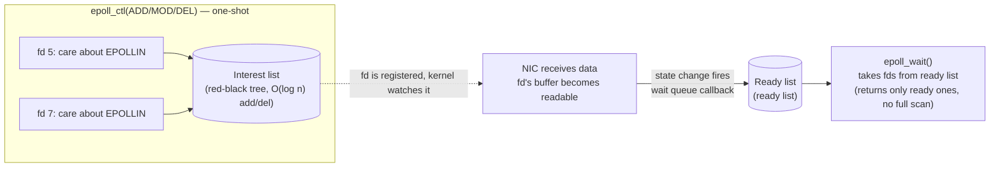

# epoll: Linux I/O multiplexing — from poll's bottleneck to the interest list and ready list

In the previous piece we ran an echo server on the "spawn a thread per connection" model and measured 2000 idle connections eating virtual memory up to 24GB — because each thread has a default 8MB stack, so 10k connections is 80GB of virtual address space, and most of those threads spend their time **blocked on `read` waiting for data**, pure waste. The conclusion is clear: you can't have the heavy entity "thread" correspond one-to-one with "a connection that may sit idle for a long time".

The right direction is **I/O multiplexing**: let **one thread watch many fds at once**, and handle whichever fd has readable data. On Linux, that's `epoll`. This piece tears it open: where exactly it differs from its predecessors `poll`/`select` (why poll can't survive C10K), what it looks like in the kernel (interest list + ready list), and that **ET vs LT** switch that countless people have tripped over — we'll actually run it and let you watch how "reading only once" in ET mode drops 87712 bytes.

GCC 16.1.1 on this machine; all code compiles and runs with `-std=c++23`, and every terminal output below was actually run.

## First, why poll can't survive: the O(n) fatal wound

`select` (1983) and `poll` (1997) are epoll's predecessors, with the same idea: you hand the kernel a pile of fds and ask "which of these are readable?"; the kernel scans them and tells you. Their fatal weakness is **every call re-passes all fds, the kernel scans them all in O(n), and on return user space still has to walk them in O(n) again to find which few are ready**. At this point I bet you're starting to grin — what a waste.

Taking poll as the example, the pseudocode looks like this:

```cpp
std::vector<pollfd> fds;                 // every fd you care about; 10k connections = 10k of these
for (;;) {
    int n = ::poll(fds.data(), fds.size(), -1);   // pass all 10k fds into the kernel
    for (int i = 0; i < fds.size(); ++i) {        // ★ O(n) walk to find the ready ones
        if (fds[i].revents & POLLIN) handle(fds[i].fd);
    }
}
```

Two problems: **① every call copies all fds into the kernel** (10k `pollfd`s, 8 bytes each, an 80k-element copy); **② the readiness info comes back "mashed into the array", and you have to walk it in O(n) yourself**. Once connections reach five digits, these two steps alone burn noticeable CPU per loop — and **the more connections, the slower it gets** (the n in O(n) is growing).

`select` is worse: it uses an `fd_set` bitmap and has a hard `FD_SETSIZE` cap (default 1024). `poll` drops the bitmap for an array, removing the 1024 cap, but the O(n) nature is unchanged.

epoll's revolution: it **doesn't re-pass fds on every call**. Instead it **pre-registers** "which fds I care about" into the kernel, and the kernel keeps track for you; when an fd is ready, the kernel **hands you just the ready fds** (a ready list) — what you get is "these few are ready", with no full scan. No matter how many connections, as long as few are ready, the cost stays small — that's the root of how it survives C10K.

## epoll's kernel model: interest list + ready list

epoll maintains **two data structures** in the kernel (this is the key to understanding all its behavior):

- **Interest list**: every fd you've registered via `epoll_ctl(ADD)` and "declared interest in". The kernel stores it in a **red-black tree**, so adding or removing an fd is O(log n) — register once, in the book permanently, no need to re-pass.
- **Ready list**: the linked list of fds that currently "have events". What `epoll_wait` does is **take ready fds out of this list** for you.

So how does an fd get from the "interest list" into the "ready list"? Through the kernel's **wait queue** mechanism: for every registered fd, the kernel hangs a callback off its underlying file object; when the NIC receives data into that fd's receive buffer (a state change), the callback fires and the kernel **stuff that fd onto the ready list**. `epoll_wait` wakes up, finds the ready list non-empty, and copies those fds out to user space.



The three APIs map to these three jobs:

```cpp
int ep = ::epoll_create1(0);                 // create an epoll instance (kernel allocs interest list + ready list)

epoll_event ev{}; ev.events = EPOLLIN; ev.data.fd = fd;
::epoll_ctl(ep, EPOLL_CTL_ADD, fd, &ev);     // add fd to interest list, declare EPOLLIN

std::array<epoll_event, 128> evs;
int n = ::epoll_wait(ep, evs.data(), evs.size(), -1);   // take ready ones (blocking wait)
```

Contrast with poll: poll passes all fds into the kernel to scan every round; epoll **registers once, in the book permanently**, and `epoll_wait` takes only the ready ones — **the cost scales with "number of ready fds", independent of "total fds"**. That's the mathematical reason epoll survives C10K.

## LT vs ET: the switch that flips countless people

When `epoll_ctl` registers an fd, the `events` field holds event types like `EPOLLIN` (readable) and `EPOLLOUT` (writable), plus a switch deciding the **notification style**: `EPOLLET`. With it, you get **ET (edge-triggered)**; without it, you get the default **LT (level-triggered)**. The difference between these two modes is epoll's most trap-prone spot, and the one most worth explaining thoroughly.

### Behavioral difference (the phenomenon first)

- **LT (default)**: as long as the fd is **still in the "readable" state** (there's still unread data in the receive buffer), every `epoll_wait` notifies you of this fd. Didn't finish reading? It notifies you again next time. **Convenient, hard to misuse, but may notify frequently.**
- **ET (`EPOLLET`)**: it notifies you **once**, only on the **edge where the fd goes from "not readable" to "readable"**. After that, even if a pile of data sits unread in the buffer, as long as no "new data arrived" edge appears, **it never notifies you again**. **Few notifications, efficient, but you must drain the data in one shot, or the remainder gets "forgotten".** Efficient, yes — also a high-bug zone.

### The real difference at the kernel level (why ET notifies once)

Why does LT keep notifying while ET notifies once? It comes down to when the kernel "puts the fd onto the ready list":

- **LT**: when the fd's wait queue callback fires, it enters the ready list; **when `epoll_wait` pulls it out and finds it can still be read (state still satisfied), it puts it back on the ready list** — so the next `epoll_wait` still gets it. The essence is "state satisfied → always ready".
- **ET**: when the fd enters the ready list, the kernel **marks it "has-been-ready"**; only when **new data arrives** (a new edge of not-readable → readable) does it enter the list **again**. So one edge buys one notification, and whether you drained the data or not, the kernel doesn't care — **if you didn't drain it, you won't be called again**.

Which brings us to the iron rule of ET —

## ET's weak point: non-blocking + read-to-EAGAIN in a loop

Since ET won't call you again after one notification, you **must drain the fd's data thoroughly within that one notification**, or the rest "sits in the buffer waiting for a next handling that never comes". How do you know it's drained? **Loop `read` until `read` returns `-1` with `errno == EAGAIN`** (meaning "buffer is temporarily empty").

And here's a hard constraint: **under ET, the fd must be non-blocking**. Why? Because in your read loop, on the last "drained" `read`, if it's a **blocking fd**, `read` won't return EAGAIN — it'll **block** there waiting for the next chunk, freezing your event loop dead (this thread is still watching other fds). A non-blocking fd returns `-1 / EAGAIN` immediately on "temporarily empty", and you exit the loop on that, going back to handle other fds. So: **ET + non-blocking + loop-to-EAGAIN, all three, non-negotiable.**

Let's run an instrumented LT server (which also uses the correct "loop-read to EAGAIN" posture) so you can see "how many reads happen in one event, and how it wraps up":

```text
[event#1] fd=5 : 4 reads, 14480 bytes, then EAGAIN -> stop loop
[event#2] fd=5 : 8 reads, 28960 bytes, then EAGAIN -> stop loop
[event#3] fd=5 : 14 reads, 56560 bytes, then EAGAIN -> stop loop
```

Look clearly at what happens inside one `epoll_wait` event: the first round **reads 4 times for 14480 bytes**, stopping only when `read` returns EAGAIN; the next round 8 times for 28960; the next 14 times for 56560. **One event may need many reads to drain** — that's exactly why "reading only once" is wrong under ET; the remaining data just sits there, abandoned.

## In practice: how ET-read-once loses 87712 bytes

Let's reproduce the ET pit for real. Write an ET server but **deliberately `read` only once per event** (many notes floating around the web copy this mistake):

```cpp
// register the connection as ET
epoll_event e{}; e.events = EPOLLIN | EPOLLET; e.data.fd = c;
::epoll_ctl(ep, EPOLL_CTL_ADD, c, &e);
// ...on receiving an event:
ssize_t r = ::read(fd, buf.data(), buf.size());   // ★BUG: only one read, no loop to EAGAIN
```

Then write a burst client that sends 100KB at once, reads the echo back, and counts bytes. First run the **correct LT server** (loops read to EAGAIN), then the **ET-read-once server**:

```text
=== run A: LT server (correct, loop-read to EAGAIN) ===
sent 100000 bytes to :13014
got back 100000 bytes (expected 100000)        ← full echo

=== run B: ET read-once server (the trap) ===
sent 100000 bytes to :13015
got back 12288 bytes (expected 100000)
>>> LOST 87712 bytes — this is the ET read-once trap   ← lost 87KB!
```

The LT version echoes all 100000 bytes; the ET-read-once version echoes only 12288, and **the remaining 87712 bytes sit forever stuck in the server's socket receive buffer** — because ET only notified once, on the "data arrived" edge; the server read once (a few reads within that edge, 12288 total) and stopped, with 87KB still in the buffer, but **no new "data arrived" edge ever comes to trigger the next notification**, and the server is oblivious. The client waits 2 seconds (timeout) without receiving the rest and can only report LOST.

### This is the classic "don't get fooled by tests"

Note one fatal point: **if the client sends only a small 4KB message, the ET-read-once version echoes it correctly too** — because 4KB is drained in one read, no "residue". So you write a unit test with small messages, all green; you ship, hit real large requests or file uploads, and data silently goes missing without even crashing — **the most insidious kind of bug**.

That's exactly why Lab 0's MS3 in this series makes "no data lost under a large burst" an **adversarial acceptance criterion**: the test must actively create "single-event data far larger than the read buffer" scenarios to catch this pit. If it can't pass that acceptance, your ET server is wrong.

::: warning ET must loop read to EAGAIN, and the fd must be non-blocking
Under ET, on receiving `EPOLLIN` you **must `for(;;)` loop `read` until it returns `-1/EAGAIN`**, draining the data. The fd must be set `O_NONBLOCK` first, or the final "drained" `read` will block and freeze the event loop. Under LT, you can get away without looping (it re-notifies if you don't finish), but loop-read-to-EAGAIN is the correct posture common to both modes — make it a habit and you won't go wrong.
:::

## Wrap-up

- **poll/select can't survive C10K**: every call passes all fds into the kernel for an O(n) scan, and on return user space still walks in O(n) to find the ready ones; the more connections, the slower. select also has the `FD_SETSIZE` (1024) hard cap.
- **epoll breaks through with "register once, in the book permanently"**: interest list (red-black tree, O(log n) add/del) + ready list (wait queue callback fires to enqueue). `epoll_wait` takes only ready fds, **cost proportional to the number of ready fds, independent of total fds**.
- **Three APIs**: `epoll_create1` (make the instance) → `epoll_ctl` (ADD/MOD/DEL manages the interest list) → `epoll_wait` (take from the ready list).
- **LT vs ET**: LT re-notifies as long as state is satisfied (convenient); ET notifies once on the not-readable → readable edge (efficient but requires draining). Kernel difference: LT re-queues on pull-out if still readable, ET enqueues only on new-data edges.
- **ET iron rule**: `non-blocking fd` + `loop read to EAGAIN`, all three, non-negotiable. Measured: one event took 4–14 reads to reach EAGAIN — "reading only once" under ET drops data (reproduced: 100KB loses 87KB).
- **"Don't get fooled by tests"**: ET-read-once passes with small messages; only a large burst exposes it. "No data lost under large burst" is Lab 0 MS3's adversarial acceptance.

With this piece, we can already have **one thread watch thousands of fds**. But the scattered "pile of `if (fd == listener) ... else ...`" event handling starts tangling by the third connection type. The next piece wraps this epoll into the **Reactor pattern** — a "event loop + callback" skeleton that gives event-driven code structure and room to grow.

## References

- [man 2 epoll_create1](https://man7.org/linux/man-pages/man2/epoll_create1.2.html) / [man 2 epoll_ctl](https://man7.org/linux/man-pages/man2/epoll_ctl.2.html) / [man 2 epoll_wait](https://man7.org/linux/man-pages/man2/epoll_wait.2.html) — authoritative definitions of the three APIs
- [man 7 epoll](https://man7.org/linux/man-pages/man7/epoll.7.html) — "epoll semantics", including the `O(O)` ready-notification wording and "avoid starvation"
- [man 2 poll](https://man7.org/linux/man-pages/man2/poll.2.html) — poll's O(n) model, for contrast with epoll
- [The C10K problem (Dan Kegel)](https://kea.dev/notes/the-c10k-problem) — the direct motivation for epoll's birth
- [epoll kernel impl: fs/eventpoll.c](https://github.com/torvalds/linux/blob/master/fs/eventpoll.c) — the source of the interest list (red-black tree `ep_insert`) and ready list (`ep_poll_callback` enqueue)
- [Modern socket wrapping: RAII and the C10K measurement (series, prev, 01)](./01-modern-socket-wrapping.md) — the measured failure of thread-per-connection at scale, the motivation starting point for epoll here
- [Traditional socket programming: the server five-step and TCP handshake (series 00)](./00-traditional-socket-basics.md) — the socket five-step foundation
- [The Reactor pattern (series, next)](./03-reactor-pattern.md) — the structured skeleton wrapping epoll into event loop + callbacks
