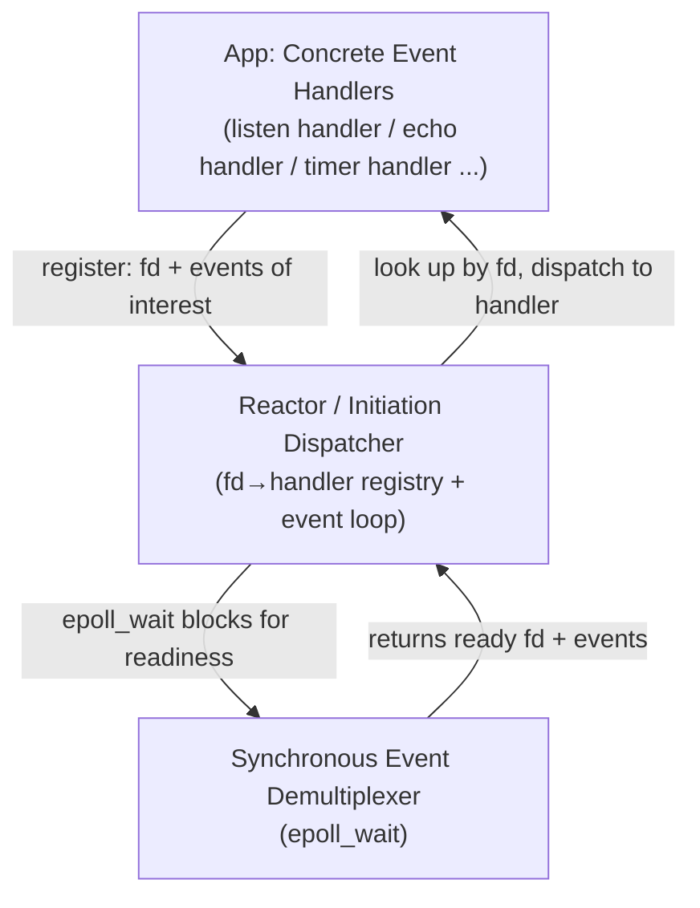
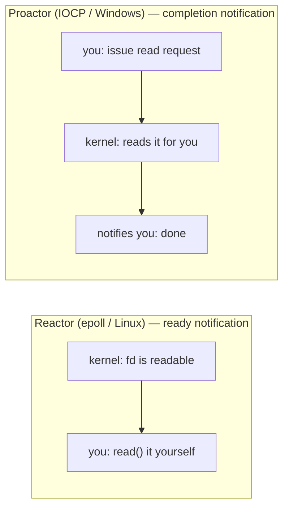

# The Reactor pattern: wrapping epoll into an event loop + callbacks, and why it's "synchronous non-blocking"

In the previous piece we wrote an echo server with epoll, and one thread can now watch a pile of fds. But look back at that event-handling code — it looks like this:

```cpp
for (int i = 0; i < n; ++i) {
    int fd = evs[i].data.fd;
    if (fd == lfd) {
        // logic to accept a new connection ...
    } else {
        // logic to echo an existing connection ...
    }
}
```

Right now there are only two kinds of fd (listening + connection), and `if/else` holds up. But the moment your server has to handle "accepting connections", "timers", "signals", "Unix domain sockets", even "pipe notifications" at once, this scattered `if/else` bloats into a tangle — every new fd type means editing the event loop's core code. We need a **structure**: decouple "the event loop" from "the per-fd-type handling logic", so adding a new fd type doesn't touch the core. That structure is the **Reactor pattern**.

## What Reactor is: the POSA2 four roles

Reactor is the classic name *Pattern-Oriented Software Architecture, Volume 2* (POSA2) gives to event-driven I/O. It has four roles:

| Role | What it is | In this piece |
|---|---|---|
| **Handle** | A kernel identifier for an I/O resource | fd (socket, timerfd, eventfd…) |
| **Synchronous Event Demultiplexer** | Blocks waiting on a set of Handles until one is ready | `epoll_wait` (the one piece 2 covered) |
| **Event Handler** | A callback interface for "what to do when a given fd is ready" | `handle_event(fd, events)` |
| **Initiation Dispatcher** = **the Reactor itself** | Keeps the fd→handler registry, runs the event loop, dispatches ready events to the right handler | our `EventLoop` class |

The full picture:



The key is **decoupling**: the Reactor itself only does "registry + loop + dispatch"; it **neither knows nor cares** how a particular fd is handled — that's the handler's job. Adding a new fd type? Write a new handler, register it with the Reactor, and the event loop doesn't change a line. That's the value of the pattern.

## Refactoring piece 2's epoll echo into Reactor

Piece 2's `epoll_lt.cpp` is actually **already a minimal Reactor** — the roles just aren't spelled out separately. Let's refactor it into what the pattern should look like, so the structure is clear:

```cpp
// Event handler interface: called with handle_event when an fd is ready
class EventHandler {
public:
    virtual ~EventHandler() = default;
    virtual void handle_event(uint32_t events) = 0;
    virtual int fd() const = 0;
};

// The Reactor itself: registry + event loop
class Reactor {
public:
    void add(int fd, uint32_t events, std::unique_ptr<EventHandler> h) {
        epoll_event ev{}; ev.events = events; ev.data.fd = fd;
        ::epoll_ctl(ep_, EPOLL_CTL_ADD, fd, &ev);
        handlers_[fd] = std::move(h);          // fd → handler registry
    }
    void run() {
        for (;;) {
            int n = ::epoll_wait(ep_, evs_.data(), evs_.size(), -1);  // Demultiplexer
            for (int i = 0; i < n; ++i) {
                int fd = evs[i].data.fd;
                handlers_[fd]->handle_event(evs[i].events);           // dispatch
            }
        }
    }
private:
    int ep_{::epoll_create1(0)};
    std::array<epoll_event, 128> evs_;
    std::unordered_map<int, std::unique_ptr<EventHandler>> handlers_; // registry
};
```

Now "listening" and "echo" are two independent handlers, each implementing `handle_event`, registered into the Reactor. Want to add a timer? Write a `TimerHandler`, register it, `Reactor::run` doesn't move. **The core loop and the business logic are fully separated** — that's where Reactor beats scattered `if/else`.

Piece 2's `epoll_lt` (and that ET-loses-data counterexample) is the flesh and blood of this pattern: the Reactor pattern is only a skeleton; the **engineering-correctness details** — ET/LT, non-blocking, loop-read-to-EAGAIN — **all live inside the handlers**. The pattern doesn't guarantee correctness for you; it guarantees structure.

## "Synchronous non-blocking": a counterintuitive name

Reactor is often called a "**synchronous non-blocking**" event-driven style, a name that looks contradictory at first — "both synchronous and non-blocking". Unpack it and it makes sense:

- **Non-blocking**: every fd is `O_NONBLOCK` (piece 2 covered this — mandatory for ET, recommended for LT too). `read`/`write` won't stall the thread.
- **Synchronous**: the event loop calls handlers **in the same thread, synchronously**. `epoll_wait` returns ready events synchronously, and a handler runs to completion synchronously before returning to the loop — **no cross-thread, no "fire a separate callback when the operation completes"**. The whole server runs the event loop in one (or a few) threads, processing events in order.

So "synchronous" refers to the **processing model** (single-threaded, sequential dispatch), not "I/O blocking". Its difference from true "asynchronous (Proactor)" is exactly the core of the next section.

## Reactor vs Proactor: ready notification vs completion notification

This is the one pair of concepts in network programming most worth clearing up at once, and also the **load-bearing beam** for the rest of this series:

- **Reactor (ready notification)**: the kernel tells you "this fd **can be read now**" (state is ready), and **you `read` it yourself** to move the data. How fast, how much — your problem. Linux's epoll is Reactor. This entire piece is it.
- **Proactor (completion notification)**: you tell the kernel "**read this fd's buffer for me**", the kernel **reads the data for you**, and on completion **notifies you "done, data's here"**. Windows' **IOCP** is a native Proactor.



The essence of the difference: **who executes that actual `read`/`write` syscall**. In Reactor it's you (`read` inside the handler); in Proactor it's the kernel (you only issue the request). The Linux kernel **has no native general Proactor interface** (io_uring is half of one, covered separately later), so for a Linux networking library to offer a Proactor-style API it can only **simulate it with Reactor** — which is exactly what the next piece, **Boost.Asio**, does: what it exposes upward is a Proactor style (`async_read` registering a completion callback), but underneath, on Linux, it's implemented with epoll (Reactor). Only on Windows does it land on native IOCP.

This "Proactor implemented with Reactor" load-bearing beam welds the three pure-Linux foundation pieces of this series (socket → epoll → Reactor) together with Asio after it, and with the eventually-slotted-in Windows IOCP: you've now hand-written a Reactor; Asio says "I wrapped the Reactor you hand-wrote into a Proactor interface"; IOCP fills in "the native half of Proactor".

## Graceful shutdown: the engineering close-out of Reactor

A usable Reactor server is missing one last piece: **graceful shutdown**. You can't just `Ctrl+C` and kill the process — that brutally `close`s in-flight connections, and the peer gets an RST. The right posture:

1. A **signal handler** changes `epoll_wait`'s timeout from `-1` (block forever) to a short timeout, or uses an eventfd to wake it.
2. **Stop accepting new connections** (remove the listening fd from the interest list).
3. **Drain**: finish sending the remaining data to existing connections, wait for them to close naturally or time out.
4. Finally exit the loop.

This involves signal/event-loop cooperation (a signal interrupts `epoll_wait` at any time, returning `EINTR`), and the lifecycle question of "how in-flight handlers wrap up" — plenty of pitfalls (our old notes have a real bug where "accept blocking causes `join` to hang"). These **engineering details are exactly what Lab 0's MS4 (graceful shutdown) in this series trains as adversarial acceptance**: after SIGTERM, no hanging `join`, no leaked fd, no RST to the peer.

## Wrap-up

- **The Reactor pattern** decouples "event loop" from "fd-handling logic": the Reactor itself manages registry + loop + dispatch; handlers manage the specifics. Adding a new fd type means writing a handler, not touching the core.
- **POSA2 four roles**: Handle (fd) / Synchronous Event Demultiplexer (`epoll_wait`) / Event Handler (`handle_event`) / Initiation Dispatcher (the Reactor itself). Piece 2's `epoll_lt.cpp` is a minimal Reactor.
- **"Synchronous non-blocking"**: non-blocking means every fd is `O_NONBLOCK`; synchronous means single-threaded, sequential event dispatch — not "I/O blocking".
- **Reactor (ready notification) vs Proactor (completion notification)**: the former has the kernel announce "readable" and you read yourself (epoll); the latter has the kernel read for you then announce completion (IOCP). The essence of the difference is **who executes that read/write syscall**.
- **The load-bearing beam**: Linux has no native Proactor; networking libraries (Boost.Asio) simulate Proactor with Reactor (epoll); Windows IOCP is a native Proactor. These three pure-Linux foundation pieces and the later Asio/IOCP are welded together by this.
- **Graceful shutdown** is Reactor's engineering close-out (signal → stop accept → drain → exit), the adversarial acceptance for Lab 0 MS4.

With this, the three Linux networking foundation pieces (socket → epoll → Reactor) are complete. Next we first add **io_uring** — Linux's new completion-driven primitive, completing the "backend tour" (epoll ready-driven + io_uring completion-driven); only after that do we enter **Boost.Asio**, where you'll see it wrap this hand-written epoll/Reactor into a cross-platform Proactor-style API, upgrading this piece's "event loop + callback" into "issue async operation + register completion callback".

## References

- [POSA2 — Reactor pattern (Doug Schmidt)](https://www.dre.vanderbilt.edu/~schmidt/PDF/Reactors.pdf) — the original Reactor pattern paper, source of the four-role definition
- [Reactor - An Object Behavioral Pattern for Demultiplexing...](https://www.dre.vanderbilt.edu/~schmidt/PDF/POSA2.pdf) — the relevant POSA2 chapter
- [Boost.Asio — The Proactor Design Pattern: Concurrency Without Threads](https://www.boost.org/doc/libs/1_91_0/doc/html/boost_asio/overview/core/async.html) — Asio's own account of "Proactor implemented with Reactor", the official statement of the load-bearing beam
- [epoll: the I/O multiplexing foundation (series, prev)](./02-epoll-io-multiplexing.md) — Reactor's Demultiplexer is epoll
- io_uring: Linux's new completion-driven primitive (next piece, to be written) — completes the backend tour; after that, Boost.Asio, wrapping this piece's Reactor into a Proactor-style API
