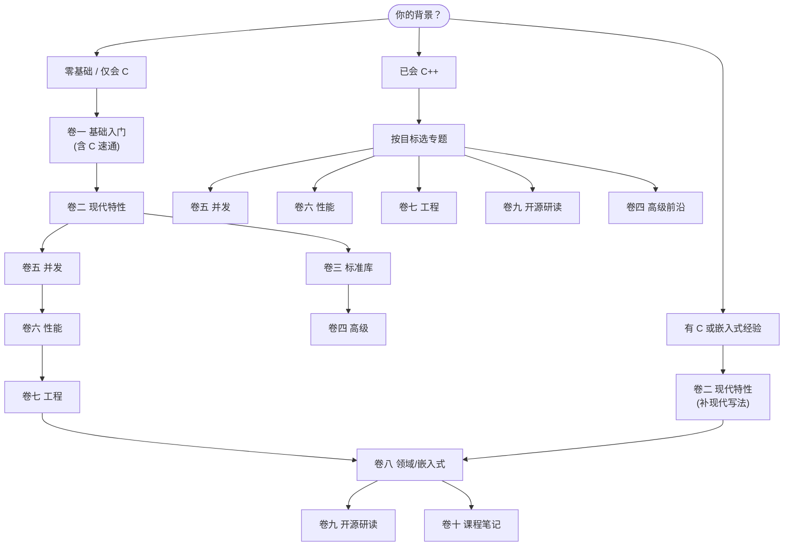

# 学习路线图

这份路线图告诉你：**这套教程该怎么学、从哪里开始、每一卷教什么**。

它面向「想系统掌握现代 C++」的人——无论你是零基础、有 C/嵌入式背景，还是已经会写 C++ 想补齐工程能力。下面先按背景选起点，再逐卷展开。

> 这里是**学习路线图**（读者怎么学）。项目本身的开发进展与规划是另一回事，见文末[内容成熟度与项目路线图](#内容成熟度与项目路线图)。

## 这份路线图怎么用

整套教程按一条递进主线组织：

```
基础 → 现代特性 → 标准库 → 高级 → 并发 → 性能 → 工程 → 领域实战
```

- **不是语法速查**：每个关键概念都配可编译的 CMake 示例，能跑、能改、能验证。
- **卷与卷之间有依赖**：后面的卷默认你掌握了前面的核心（尤其卷一→卷二是关键分水岭）。
- **可以跳读**：有相关背景的读者不必从卷一第一页读起，按下面的「三条路径」选起点即可。
- **配套资源随时查**：[C++ 特性参考卡](/cpp-reference/)（C++98→C++23 速查）、[实战项目](/projects/)、[课程笔记](/vol10-open-lecture-notes/)。

## 三条学习路径（按背景选起点）



- **路径 A · 零基础 / 仅会 C**：从 [卷一](/vol1-fundamentals/) 开始（含 C 语言速通），沿主线一卷卷走。最稳，也最长。
- **路径 B · 有 C 或嵌入式经验**：你的语法底子够，直接进 [卷二](/vol2-modern-features/) 补「现代 C++ 写法」，然后扎进 [卷八 嵌入式](/vol8-domains/) 实战，按需补并发（五）/性能（六）/工程（七）。
- **路径 C · 已会 C++**：按目标直取专题——要并发读 [卷五](/vol5-concurrency/)，要性能读 [卷六](/vol6-performance/)，要工程化读 [卷七](/vol7-engineering/)，想读大型源码读 [卷九](/vol9-open-source-project-learn/)，追前沿读 [卷四](/vol4-advanced/)。

## 卷级详解

### 卷一 · 基础入门

- **定位**：从零建立 C++ 完整知识体系，含一份完整的 C 语言速通教程。
- **关键主题**：环境搭建 · 类型系统与值类别 · 控制流与函数 · 指针与引用 · 数组与字符串（`std::array`/`std::string`） · 类与面向对象 · 继承与多态 · 模板初步与异常。
- **规模**：约 102 篇（全仓最厚）。
- **亮点**：C 语言速通复习 · 值类别深度剖析 · 智能指针预览 · STL 初见。
- **难度 / 前置**：入门 → 中级 / 无前置。
- **建议节奏**：零基础全读；有基础可跳过 C 速通，重点看值类别、OOP、模板初步。

### 卷二 · 现代特性

- **定位**：系统掌握 C++11/14/17 核心特性，是「会写 C++」与「会写现代 C++」的关键分水岭。
- **关键主题**：移动语义与右值引用 · 智能指针与 RAII · `constexpr` 编译期计算 · Lambda 与函数式 · 类型安全（`enum class`/`variant`/`optional`） · 结构化绑定 · `auto`/`decltype`/`string_view`/`filesystem`。
- **规模**：约 56 篇。
- **亮点**：移动语义实践 · RAII 深度剖析 · Lambda 捕获详解 · `string_view` 性能与陷阱。
- **难度 / 前置**：中级 / 卷一。
- **建议节奏**：核心转折卷，务必精读；这一卷决定你后续所有卷的顺畅度。

### 卷三 · 标准库深入

- **定位**：STL 容器与字符串的实现细节、性能与内存底层机制。
- **关键主题**：`vector` 动态扩容与迭代器失效 · `string` 内存模型与小字符串优化 · `char8_t` 与 UTF-8 · `span` · 自定义分配器 · 对象大小与平凡类型。
- **规模**：约 8 篇（篇幅小但深）。
- **亮点**：`vector` 实现与性能分析 · `string` 内存模型深度剖析 · 自定义分配器。
- **难度 / 前置**：中级 / 卷一、卷二。
- **建议节奏**：按需精读；做性能敏感或嵌入式开发时回头看。

### 卷四 · 高级主题

- **定位**：C++20/23/26 前沿特性与元编程技术，写库、写高性能泛型代码的人必经。
- **关键主题**：模板体系（C++11→23） · 协程与调度器 · Ranges 与管道式编程 · 三路比较 `<=>` · 空基类优化 · Modules。
- **规模**：约 12 篇（部分章节重写中）。
- **亮点**：协程调度器实现 · Ranges 管道实践 · 三路比较运算符 · C++ Modules（MSVC）。
- **难度 / 前置**：高级 / 卷二、卷三。
- **建议节奏**：先读协程、Ranges、三路比较三块；其余随用随补。

### 卷五 · 并发编程

- **定位**：从线程原语到协程异步，建立完整并发判断力（先正确再性能、先锁再无锁、先同步再任务）。
- **关键主题**：线程生命周期与 RAII · 互斥与同步原语 · `atomic` 与六种内存序 · 无锁数据结构（SPSC/MPMC） · `future` 与线程池 · 协程与事件循环 · Actor/Channel。
- **规模**：约 44 篇 + 9 个练习项目（Lab 0–5 + Capstone）。
- **亮点**：内存序详解 · 无锁队列 · 协程 Echo 服务器 · Mini Concurrent Runtime（Capstone）。
- **难度 / 前置**：中高 / 卷一 ~ 卷四。
- **建议节奏**：规模最大、配套 Lab 最多，强烈建议动手做 Lab，不要只读。

### 卷六 · 性能优化

- **定位**：CPU 缓存、SIMD、汇编阅读、优化模式等 C++ 性能核心技术。
- **关键主题**：内联与编译器优化 · 性能与代码大小评估 · AVX/AVX2。
- **规模**：3 篇（重写扩充中）。
- **亮点**：内联与编译器优化 · AVX/AVX2 深入。
- **难度 / 前置**：中高 / 卷五。
- **建议节奏**：内容正在扩充；先建立缓存层级与 SIMD 直觉，后续按专题深入。

### 卷七 · 工程实践

- **定位**：C++ 软件工程落地——构建、交叉编译、链接、调试、平台开发。
- **关键主题**：CMake 与交叉编译 · 编译器选项 · 链接器与链接脚本 · WSL 开发 · MSVC 调试 · 文件 I/O 实践。
- **规模**：约 8 篇。
- **亮点**：交叉编译与 CMake · 链接器与链接脚本 · 文件拷贝器（完整 I/O 项目） · MSVC 调试原理。
- **难度 / 前置**：中级 / 建议先读「编译与链接深入」。
- **建议节奏**：配合 [编译与链接](/compilation/) 一起学；按当前工程栈挑读。

### 编译与链接深入

- **定位**：C/C++ 编译、链接、静态/动态库、符号可见性的底层机制，是工程实践的基础。
- **关键主题**：编译链接概述 · 静态库 · 动态库设计与原则 · 符号可见性 · 运行时加载 · 库搜索逻辑。
- **规模**：约 10 篇。
- **亮点**：动态库设计 · 符号可见性（ABI 层控制） · 动态库作为可执行文件。
- **难度 / 前置**：中级 / C++ 基础。
- **建议节奏**：作为卷七的前置；做嵌入式/交叉编译前必读。

### 卷八 · 领域应用

- **定位**：现代 C++ 在各垂直领域的实战，**主线是嵌入式**（STM32F1/F4）。
- **关键主题**：STM32 环境搭建 · LED/按键/UART 全流程（从 C 重构到 C++23） · 零开销抽象 · 寄存器访问 · 中断安全 ·（网络/GUI/数据存储 规划中）。
- **规模**：约 75 篇（其中嵌入式 62 篇）。
- **亮点**：LED 点灯 13 篇系列 · UART 串口 13 篇系列（含协程/`expected`/concepts） · 中断安全的代码 · 嵌入式零开销抽象。
- **难度 / 前置**：中级 / 卷一 ~ 卷七。
- **建议节奏**：嵌入式是当前最完整的领域主线，按外设循序渐进；有 STM32 板子可同步实操。

### 卷九 · 开源项目学习

- **定位**：分析工业级开源项目源码，学真实世界的 C++ 设计与实现。
- **关键主题**：Chromium `OnceCallback` 回调设计机制 ·（更多项目规划中）。
- **规模**：约 20 篇。
- **亮点**：OnceCallback——从 Chromium 学到的回调设计（完整系列）。
- **难度 / 前置**：中高 / 卷一 ~ 卷七（尤其卷四、卷五、卷七）。
- **建议节奏**：读源码导向；建议先掌握卷四高级特性，再来读工业级实现。

### 卷十 · 课程与演讲笔记

- **定位**：CppCon 等技术会议演讲与开源课程的阅读笔记和二次创作。
- **关键主题**：CppCon 2025——概念泛型编程 · Ranges · 移动语义 · 底层汇编阅读。
- **规模**：约 24 篇。
- **亮点**：Concept-based Generic Programming · Back to Basics: Ranges · Back to Basics: Move Semantics。
- **难度 / 前置**：中级 / 卷一 ~ 卷五。
- **建议节奏**：用作「深化」——学完对应卷后看相关演讲笔记加固理解。

## 学习节奏与建议

- **时间预期**：零基础走完整条主线是长期工程（数百篇 + 实战），别指望速成；按卷设里程碑，每卷配示例动手敲。
- **推荐顺序**：严格按 一→二→三→四→五→六→七→八 的依赖走最稳；有背景则按「三条路径」切入。
- **跳读策略**：卷一可跳 C 速通；卷三/卷六/卷九篇幅小或扩充中，按需读；卷十可穿插在对应卷之后当复习。
- **用实战串联**：每学完一块，去 [实战项目](/projects/) 找对应项目练手（协程服务器、并发运行时、嵌入式等），把零散知识捏成完整能力。

## 配套资源

- [C++ 特性参考卡](/cpp-reference/)：C++98→C++23 共约 46 篇速查，按标准版本与功能类别双视图。
- [贯穿式实战项目](/projects/)：把各卷知识串成可交付项目。
- [社区文章](/community/)：社区来稿与审阅收录，也欢迎你投稿。
- [卷十 课程笔记](/vol10-open-lecture-notes/)：CppCon 等顶级演讲的二次创作，深化用。

## 内容成熟度与项目路线图

各卷的当前状态（供你判断哪部分内容最扎实）：

- ✓ **成熟稳定**：卷一 基础、卷二 现代特性、编译与链接深入。
- ✦ **推进中**：卷三 标准库、卷四 高级、卷五 并发、卷七 工程、卷八 嵌入式、卷十 课程笔记。
- ◇ **扩充/规划中**：卷六 性能、卷九 开源研读、卷八的 网络/GUI/数据 子领域。

想看**项目本身的开发规划**（要做什么、发布节奏、TODO 优先级），那是另一份文档：

- 📋 [项目开发路线图（`community/dev/`）](/community/dev/) — 维护节奏、发布治理、站点演进。
- 📦 [版本变更记录（`changelogs/`）](https://github.com/Awesome-Embedded-Learning-Studio/Tutorial_AwesomeModernCPP/tree/main/changelogs) — 每个已发布版本改了什么。

> 简言之：**学习路线图**（本页）回答「我该怎么学」；**项目路线图**回答「这个项目在做什么」。
