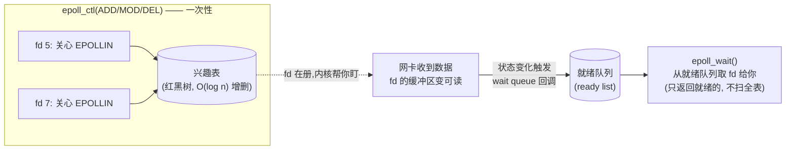

# epoll:Linux I/O 多路复用,从 poll 的瓶颈到兴趣表与就绪队列

上一篇我们用"每来一个连接 spawn 一个线程"的模型跑了个 echo server,实测 2000 个空闲连接就把虚拟内存吃到 24GB——因为每线程默认 8MB 栈,1 万连接就是 80GB 虚拟地址空间,而且这些线程大部分时间都**阻塞在 `read` 上干等数据**,纯属浪费。结论很清楚:不能让"线程"这个重实体去一对一对应"一个可能长期空闲的连接"。

正确方向是 **I/O 多路复用**:让**一个线程同时盯着很多个 fd**,谁的 fd 有数据可读了,再去处理谁。Linux 上干这件事的就是 `epoll`。这一篇我们拆透它:它和前辈 `poll`/`select` 到底差在哪(为什么 poll 撑不住 C10K)、它在内核里长什么样(兴趣表 + 就绪队列)、以及那个让无数人踩坑的 **ET vs LT** —— 我们会真跑一次,让你看见 ET 模式下"只读一次"是怎么丢掉 87712 字节的。

本机 GCC 16.1.1,所有代码 `-std=c++23` 可编译可运行,下面贴的终端输出都是真跑出来的。

## 先看 poll 为什么撑不住:O(n) 的致命伤

`select`(1983)和 `poll`(1997)是 epoll 的前辈,思路一样:你把一堆 fd 交给内核,问"这堆里哪些可读了?",内核扫一遍告诉你。它们的命门是**每次调用都要把全部 fd 重新传一遍,内核也得 O(n) 全扫一遍,返回后用户态还要再 O(n) 遍历找出到底哪几个就绪了**。到这里我打赌你开始笑了——真多余啊。

以 poll 为例,伪代码长这样:

```cpp
std::vector<pollfd> fds;                 // 你关心的所有 fd,1 万个连接就是 1 万个
for (;;) {
    int n = ::poll(fds.data(), fds.size(), -1);   // 把 1 万个 fd 全传进内核
    for (int i = 0; i < fds.size(); ++i) {        // ★O(n) 遍历找就绪的
        if (fds[i].revents & POLLIN) handle(fds[i].fd);
    }
}
```

问题在两处:**① 每次都得把全部 fd 拷进内核**(1 万个 `pollfd`,每个 8 字节,8 万元素的拷贝);**② 返回的就绪信息是"揉在数组里的",你得自己 O(n) 遍历**。连接数一上万,光这两步每次循环就耗掉可观 CPU——而且**连接数越多越慢**(O(n) 的 n 在涨)。

`select` 更糟:它用一个 `fd_set` 位图,且有 `FD_SETSIZE`(默认 1024)的硬上限。`poll` 去掉了位图改用数组,没了 1024 上限,但 O(n) 的本质没变。

epoll 的革命就在于:它**不在每次调用时重新传 fd**,而是把"我关心哪些 fd"这件事**提前注册**进内核,内核帮你维护着;有 fd 就绪时,内核**直接把就绪的 fd 单独给你**(一个就绪链表),你拿到的就是"哪几个就绪了",不用全量扫描。连接数再多,只要就绪的少,开销就小——这就是它扛得住 C10K 的根本。

## epoll 的内核模型:兴趣表 + 就绪队列

epoll 在内核里维护**两个数据结构**(这是理解它全部行为的钥匙):

- **兴趣表(interest list)**:你通过 `epoll_ctl(ADD)` 注册进来、"声明关心"的所有 fd。内核用**红黑树**存它,所以增删一个 fd 是 O(log n)——注册一次,永久在册,不用每次重新传。
- **就绪队列(ready list)**:当前"有事件"的 fd 链表。`epoll_wait` 干的事就是**从这个链表里取**就绪的 fd 给你。

那 fd 是怎么从"兴趣表"进到"就绪队列"的?靠内核的 **wait queue(等待队列)** 机制:每个注册的 fd,内核在它的底层文件对象上挂一个回调;当网卡把数据收到该 fd 的接收缓冲区(状态变化)时,这个回调被触发,内核就把这个 fd **塞进就绪队列**。`epoll_wait` 醒来,发现就绪队列非空,把里面的 fd 拷给用户态。



三个 API 对应这三件事:

```cpp
int ep = ::epoll_create1(0);                 // 建一个 epoll 实例(内核分配兴趣表+就绪队列)

epoll_event ev{}; ev.events = EPOLLIN; ev.data.fd = fd;
::epoll_ctl(ep, EPOLL_CTL_ADD, fd, &ev);     // 把 fd 加进兴趣表,声明关心 EPOLLIN

std::array<epoll_event, 128> evs;
int n = ::epoll_wait(ep, evs.data(), evs.size(), -1);   // 取就绪的(阻塞等)
```

对照 poll:poll 每轮把全部 fd 传进内核扫;epoll **注册一次、永久在册**,`epoll_wait` 只取就绪的——**开销和"就绪的 fd 数"成正比,和"总 fd 数"无关**。这就是 epoll 扛 C10K 的数学原因。

## LT vs ET:那个让无数人翻车的开关

`epoll_ctl` 注册 fd 时,`events` 里除了 `EPOLLIN`(可读)、`EPOLLOUT`(可写)这些事件类型,还有一个开关决定**通知方式**:`EPOLLET`。带上它就是 **ET(edge-triggered,边缘触发)**,不带就是默认的 **LT(level-triggered,水平触发)**。这两个模式的区别,是 epoll 最容易踩坑、也最值得讲透的地方。

### 行为差异(先讲现象)

- **LT(默认)**:只要 fd **还处于"可读"状态**(接收缓冲区里还有数据没读完),每次 `epoll_wait` 都会把这个 fd 通知给你。你没读完?下次还通知你。**好用、不易出错,但可能频繁通知。**
- **ET(`EPOLLET`)**:只在 fd **从"不可读"变成"可读"那个边沿**通知你**一次**。之后哪怕缓冲区里还有一堆数据没读完,只要没出现"新的数据到达"这个边沿,**它再也不通知你了**。**通知少、效率高,但你必须一次把数据读空,否则剩下的数据会被"遗忘"。** 属于是高效，但是bug高发区。

### 内核层的真正差异(为什么 ET 只通知一次)

为什么 LT 会反复通知、ET 只通知一次?关键在内核把 fd "放进就绪队列"的时机:

- **LT**:fd 的 wait queue 回调触发时把 fd 入就绪队列;**只要 `epoll_wait` 取出它时,发现它还能读到数据(状态仍满足),就把它重新挂回就绪队列**——所以下一轮 `epoll_wait` 还会拿到它。本质是"状态满足就一直就绪"。
- **ET**:fd 入就绪队列时,内核会**标记它"已就绪过"**;只有当**新的数据到达**(fd 从不可读→可读的新边沿)时才**再次**入队。所以一次边沿只换来一次通知,读完没读完内核不管——**你没读空,它也不会再叫你**。

这就引出 ET 的铁律——

## ET 的命门:非阻塞 + 循环读到 EAGAIN

既然 ET 一次通知后不再叫你,你**必须在这一次通知里把 fd 的数据彻底读空**,否则剩下的数据就"卡在缓冲区里永远等不到下一次处理"。怎么知道读空了?**循环 `read`,直到 `read` 返回 `-1` 且 `errno == EAGAIN`**(意思是"缓冲区暂时没数据了")。

而这里有个硬约束:**ET 模式下 fd 必须是非阻塞的**。为什么?因为你循环 `read`,最后一次"读空"时,如果是**阻塞 fd**,`read` 不会返回 EAGAIN——它会**阻塞**在那里等下一段数据,直接把你的事件循环卡死(这个线程还盯着别的 fd 呢)。非阻塞 fd 在"暂时没数据"时立刻返回 `-1 / EAGAIN`,你据此退出循环、回去处理别的 fd。所以:**ET + 非阻塞 + 循环到 EAGAIN,三件套缺一不可。**

我们用 instrumented 的 LT server(它也用"循环读到 EAGAIN"的正确姿势)真跑一次,让你看见"一次事件里到底 read 了几次、最后怎么收尾":

```text
[event#1] fd=5 : 4 reads, 14480 bytes, then EAGAIN -> stop loop
[event#2] fd=5 : 8 reads, 28960 bytes, then EAGAIN -> stop loop
[event#3] fd=5 : 14 reads, 56560 bytes, then EAGAIN -> stop loop
```

看清楚了一次 `epoll_wait` 事件里发生了什么:第一轮 read **4 次共 14480 字节**,直到 `read` 返回 EAGAIN 才停;下一轮 8 次共 28960;再下一轮 14 次共 56560。**一次事件可能需要很多次 read 才能读空**,这就是为什么"只 read 一次"在 ET 下是错的——剩下的数据就这么被晾在那儿了。

## 实战:ET-read-once 是怎么丢掉 87712 字节的

我们把 ET 的坑真复现一遍。写一个 ET server,但**故意每次事件只 `read` 一次**(很多网传笔记就是这么抄错的):

```cpp
// 连接注册成 ET
epoll_event e{}; e.events = EPOLLIN | EPOLLET; e.data.fd = c;
::epoll_ctl(ep, EPOLL_CTL_ADD, c, &e);
// ...收到事件时:
ssize_t r = ::read(fd, buf.data(), buf.size());   // ★BUG:只读一次,没循环到 EAGAIN
```

再写一个 burst client,一次性发 100KB,然后读回 echo 统计字节数。先跑**正确的 LT server**(循环读到 EAGAIN),再跑**ET-read-once server**:

```text
=== run A: LT server (correct, loop-read to EAGAIN) ===
sent 100000 bytes to :13014
got back 100000 bytes (expected 100000)        ← 全量回显

=== run B: ET read-once server (the trap) ===
sent 100000 bytes to :13015
got back 12288 bytes (expected 100000)
>>> LOST 87712 bytes — this is the ET read-once trap   ← 丢了 87KB!
```

LT 版全量回显 10 万字节;ET-read-once 版只回显了 12288 字节,**剩下的 87712 字节永远卡在 server 的 socket 接收缓冲区里**——因为 ET 只在"数据到达"那个边沿通知过一次,server 读了一次(连那次边沿内几个 read,共 12288)就结束了,缓冲区里还有 87KB,但**再没有新的"数据到达"边沿来触发下一次通知**,server 浑然不觉。client 这边等了 2 秒(超时)也没等到剩下的,只能报告 LOST。

### 这就是"别被测试骗了"的典型

注意一个要命的点:**如果 client 只发一个 4KB 的小消息,ET-read-once 版照样能正确回显**——因为 4KB 一次就读完了,没有"残留"。所以你拿小消息做单元测试,全绿;一上线,遇到真实的大请求/文件上传,数据就偷偷丢了,还不会崩——**最阴险的那种 bug**。

这正是本系列 Lab 0 的 MS3 要把"大 burst 不丢数据"设成**对抗性验收**的原因:测试必须主动制造"单次事件数据量远大于 read buffer"的场景,才能抓住这个坑。通不过这个验收,你的 ET server 就没写对。

::: warning ET 必须循环读到 EAGAIN,且 fd 必须非阻塞
ET 模式下,收到 `EPOLLIN` 后**必须 `for(;;)` 循环 `read` 直到返回 `-1/EAGAIN`**,把数据读空。fd 必须先设 `O_NONBLOCK`,否则最后一次"读空"的 `read` 会阻塞、卡死事件循环。LT 模式下虽然不循环也能工作(没读完下次还通知),但循环读到 EAGAIN 是两个模式通用的正确姿势,养成习惯不会错。
:::

## 小结

- **poll/select 撑不住 C10K**:每次调用要把全部 fd 传进内核 O(n) 扫描,返回后用户态还要 O(n) 找就绪的;连接数越多越慢。select 还有 `FD_SETSIZE`(1024)硬上限。
- **epoll 用"注册一次、永久在册"破局**:兴趣表(红黑树,O(log n) 增删)+ 就绪队列(wait queue 回调触发入队)。`epoll_wait` 只取就绪的,**开销与就绪 fd 数成正比,与总 fd 数无关**。
- **三个 API**:`epoll_create1`(建实例)→ `epoll_ctl`(ADD/MOD/DEL 管兴趣表)→ `epoll_wait`(从就绪队列取)。
- **LT vs ET**:LT 只要状态满足就反复通知(好用);ET 只在"不可读→可读"边沿通知一次(高效但要求读空)。内核层差异:LT 取出时仍可读就重挂就绪队列,ET 只在新数据边沿入队。
- **ET 铁律**:`fd 非阻塞` + `循环 read 到 EAGAIN`,三件套缺一不可。实测一次事件 read 了 4~14 次才到 EAGAIN——"只 read 一次"在 ET 下会丢数据(复现:100KB 丢 87KB)。
- **"别被测试骗了"**:ET-read-once 用小消息测试能过,大 burst 才暴露。大 burst 不丢数据是 Lab 0 MS3 的对抗验收。

到这一篇,我们已经能让**一个线程盯住成千上万个 fd**了。但"一堆 `if (fd == listener) ... else ...`"的散装事件处理,写到第三个连接类型就开始乱。下一篇我们把这套 epoll 包成 **Reactor 模式**——一个"事件循环 + 回调"的骨架,让事件驱动的代码有结构、可扩展。

## 参考资源

- [man 2 epoll_create1](https://man7.org/linux/man-pages/man2/epoll_create1.2.html) / [man 2 epoll_ctl](https://man7.org/linux/man-pages/man2/epoll_ctl.2.html) / [man 2 epoll_wait](https://man7.org/linux/man-pages/man2/epoll_wait.2.html) —— 三个 API 的权威定义
- [man 7 epoll](https://man7.org/linux/man-pages/man7/epoll.7.html) —— "epoll semantics",含 LT/ET 的 `O(O)` 就绪通知与"avoid starvation"等官方表述
- [man 2 poll](https://man7.org/linux/man-pages/man2/poll.2.html) —— poll 的 O(n) 模型,对照 epoll
- [The C10K problem (Dan Kegel)](https://kea.dev/notes/the-c10k-problem) —— epoll 诞生的直接动机
- [epoll 内核实现:fs/eventpoll.c](https://github.com/torvalds/linux/blob/master/fs/eventpoll.c) —— 兴趣表(红黑树 `ep_insert`)+ 就绪队列(`ep_poll_callback` 入队)的源头
- [现代 socket 封装:RAII 与 C10K 实测(本系列上一篇 01)](./01-modern-socket-wrapping.md) —— 每连接一线程扛不住并发的实测,本篇 epoll 的动机起点
- [传统 socket 编程:服务器五步与 TCP 建链(本系列 00)](./00-traditional-socket-basics.md) —— socket 五步地基
- [Reactor 模式(本系列下一篇)](./03-reactor-pattern.md) —— 把 epoll 包成事件循环 + 回调的结构化骨架
