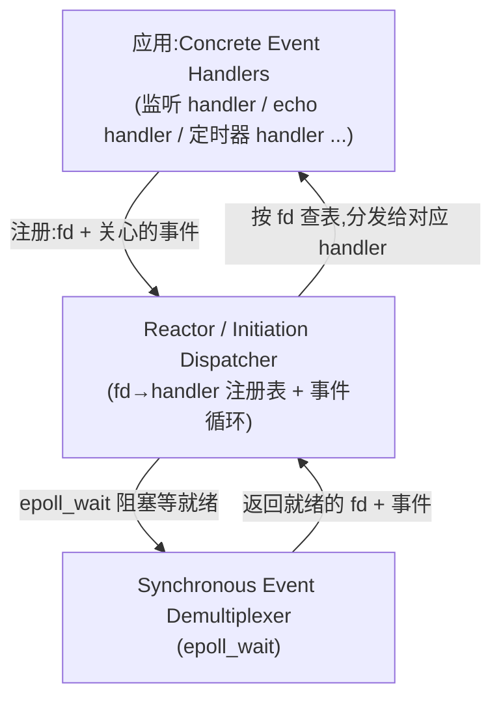
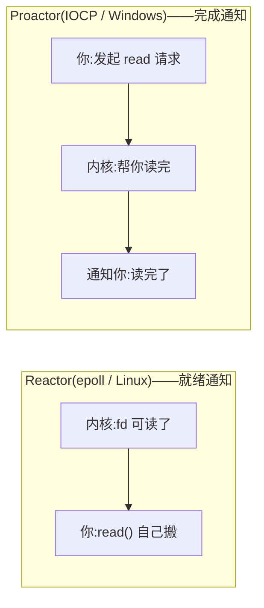

# Reactor 模式:把 epoll 包成事件循环 + 回调,以及它为什么是"同步非阻塞"

上一篇我们用 epoll 写了个 echo server,能一个线程盯住一堆 fd 了。但回头看看那个事件处理代码,长这样:

```cpp
for (int i = 0; i < n; ++i) {
    int fd = evs[i].data.fd;
    if (fd == lfd) {
        // accept 新连接的逻辑 ...
    } else {
        // echo 已有连接的逻辑 ...
    }
}
```

现在只有两种 fd(监听 fd + 连接 fd),`if/else` 还扛得住。可一旦你的 server 要同时处理"监听连接""定时器""信号""Unix domain socket"乃至"管道通知",这套散装的 `if/else` 就会膨胀成一团乱麻——每加一种 fd 就得改事件循环的核心代码。我们需要一个**结构**:把"事件循环"和"针对每种 fd 的处理逻辑"解耦,让加新 fd 类型不用动核心。这个结构就是 **Reactor 模式**。

## Reactor 是什么:POSA2 的四角色

Reactor 是《Pattern-Oriented Software Architecture, Volume 2》(POSA2)里给事件驱动 I/O 起的经典名字。它有四个角色:

| 角色 | 是什么 | 本篇对应 |
|---|---|---|
| **Handle**(句柄) | 一个 I/O 资源的内核标识 | fd(socket、timerfd、eventfd……) |
| **Synchronous Event Demultiplexer**(同步事件多路分离器) | 阻塞等待一组 Handle,直到有某个就绪 | `epoll_wait`(篇 2 讲透的那个) |
| **Event Handler**(事件处理器) | 一个"某 fd 就绪时该干什么"的回调接口 | `handle_event(fd, events)` |
| **Initiation Dispatcher**(发起分发器)= **Reactor 本体** | 维护 fd→handler 的注册表、跑事件循环、把就绪事件分发给对应 handler | 我们的 `EventLoop` 类 |

整张图:



关键在于**解耦**:Reactor 本体只管"注册表 + 循环 + 分发",它**不知道也不关心**某个 fd 具体怎么处理——那是 handler 的事。加一种新 fd 类型?写个新 handler、注册进 Reactor,事件循环一个字不用改。这就是模式的价值。

## 把篇 2 的 epoll echo 重构成 Reactor

篇 2 的 `epoll_lt.cpp` 其实**已经是一个最小 Reactor**——只是角色没显式分开。我们把它重构成模式该有的样子,让结构清晰:

```cpp
// 事件处理器接口:某个 fd 就绪时调 handle_event
class EventHandler {
public:
    virtual ~EventHandler() = default;
    virtual void handle_event(uint32_t events) = 0;
    virtual int fd() const = 0;
};

// Reactor 本体:注册表 + 事件循环
class Reactor {
public:
    void add(int fd, uint32_t events, std::unique_ptr<EventHandler> h) {
        epoll_event ev{}; ev.events = events; ev.data.fd = fd;
        ::epoll_ctl(ep_, EPOLL_CTL_ADD, fd, &ev);
        handlers_[fd] = std::move(h);          // fd → handler 注册表
    }
    void run() {
        for (;;) {
            int n = ::epoll_wait(ep_, evs_.data(), evs_.size(), -1);  // Demultiplexer
            for (int i = 0; i < n; ++i) {
                int fd = evs[i].data.fd;
                handlers_[fd]->handle_event(evs[i].events);           // 分发
            }
        }
    }
private:
    int ep_{::epoll_create1(0)};
    std::array<epoll_event, 128> evs_;
    std::unordered_map<int, std::unique_ptr<EventHandler>> handlers_; // 注册表
};
```

现在"监听"和"echo"是两个独立的 handler,各自实现 `handle_event`,注册进 Reactor。要加定时器?写个 `TimerHandler` 注册进去,`Reactor::run` 不用动。**核心循环和业务逻辑彻底分开**——这就是 Reactor 比散装 `if/else` 强的地方。

篇 2 的 epoll_lt(以及那个 ET 丢数据的反面教材)是这个模式的血肉:Reactor 模式只是骨架,ET/LT、非阻塞、循环读到 EAGAIN 这些**工程正确性细节全在 handler 里**。模式不替你保证正确性,它只保证结构。

## "同步非阻塞":一个反直觉的名字

Reactor 常被叫"**同步非阻塞**(synchronous non-blocking)"事件驱动,这名字乍看矛盾——"又同步又非阻塞"。拆开就懂了:

- **非阻塞**:所有 fd 都是 `O_NONBLOCK` 的(篇 2 讲过,ET 必须,LT 也建议)。`read`/`write` 不会卡住线程。
- **同步**:事件循环**在同一个线程里、同步地**调用 handler。`epoll_wait` 同步返回就绪事件,handler 同步执行完才回到循环——**没有跨线程、没有"操作完成后另起回调"**。整个 server 在一个(或几个)线程里跑事件循环,顺序处理事件。

所以"同步"指的是**处理模型**(单线程顺序分发),不是"I/O 阻塞"。它和真正的"异步(Proactor)"的区别,正是下一节的核心。

## Reactor vs Proactor:就绪通知 vs 完成通知

这是网络编程里最该一次讲清的一对概念,也是本系列后续的**承重梁**:

- **Reactor(就绪通知,ready notification)**:内核告诉你"这个 fd **可以读了**"(状态就绪),**你自己去 `read`** 搬数据。搬多快、搬多少是你的事。Linux 的 epoll 就是 Reactor。本篇整个就是它。
- **Proactor(完成通知,completion notification)**:你告诉内核"帮我**读这个 fd 的这段缓冲**",内核**帮你把数据读好**,读完后**通知你"读完了,数据在这儿"**。Windows 的 **IOCP** 是原生 Proactor。



差异的本质:**谁来执行那次真正的 `read`/`write` 系统调用**。Reactor 里是你(handler 里 `read`);Proactor 里是内核(你只发起请求)。Linux 内核**没有原生的通用 Proactor 接口**(io_uring 算半个,后面专门讲),所以 Linux 上的网络库要提供 Proactor 风格的 API,只能**用 Reactor 模拟**——这就是下一篇 **Boost.Asio** 要做的事:它对上层暴露的是 Proactor 风格(`async_read` 注册完成回调),但底层在 Linux 上是用 epoll(Reactor)实现的。Windows 上才落到原生 IOCP。

这条"Proactor 用 Reactor 实现"的承重梁,把本系列三篇纯 Linux 地基(socket→epoll→Reactor)和后面的 Asio、以及后插的 Windows IOCP,全部焊在了一起:你已经手写过 Reactor 了,Asio 告诉你"我把你手写的这个 Reactor 封成了一个 Proactor 接口",IOCP 则补上"Proactor 的原生半边"。

## 优雅关闭:Reactor 的工程收尾

一个能用的 Reactor server 还差最后一块:**优雅关闭**。你不能 `Ctrl+C` 直接杀进程——那样正在处理的连接会被粗暴 `close`,对端收到 RST。正确的姿势:

1. **信号 handler** 把 `epoll_wait` 的 timeout 从 `-1`(永久阻塞)改成短超时,或用一个 eventfd 唤醒它。
2. **停止 accept 新连接**(从兴趣表移除监听 fd)。
3. **drain**:给已有连接发完剩余数据、等它们自然关闭或超时。
4. 最后退出循环。

这块涉及信号与事件循环的协作(信号随时打断 `epoll_wait` 返回 `EINTR`)、以及"正在处理中的 handler 怎么收尾"的生命周期问题——坑不少(我们旧笔记里就有一个"accept 阻塞导致 `join` 挂死"的真 bug)。这些**工程细节正是本系列 Lab 0 的 MS4(优雅关闭)要练的对抗验收**:SIGTERM 后不能挂 `join`、不能漏 fd、不能让对端收到 RST。

## 小结

- **Reactor 模式**把"事件循环"和"fd 处理逻辑"解耦:Reactor 本体管注册表 + 循环 + 分发,handler 管具体处理。加新 fd 类型只写 handler,不动核心。
- **POSA2 四角色**:Handle(fd)/ Synchronous Event Demultiplexer(`epoll_wait`)/ Event Handler(`handle_event`)/ Initiation Dispatcher(Reactor 本体)。篇 2 的 `epoll_lt.cpp` 就是最小 Reactor。
- **"同步非阻塞"**:非阻塞指 fd 全 `O_NONBLOCK`,同步指单线程顺序分发事件——不是"I/O 阻塞"。
- **Reactor(就绪通知)vs Proactor(完成通知)**:前者内核通知"可读了"你自己 read(epoll);后者内核帮你读完再通知(IOCP)。差异本质是**谁执行那次 read/write 系统调用**。
- **承重梁**:Linux 无原生 Proactor,网络库(Boost.Asio)用 Reactor(epoll)模拟 Proactor;Windows IOCP 是原生 Proactor。这三篇纯 Linux 地基和后续 Asio/IOCP 由此焊在一起。
- **优雅关闭**是 Reactor 的工程收尾(信号→停 accept→drain→退),是 Lab 0 MS4 的对抗验收。

到这里,Linux 网络编程的地基三篇(socket → epoll → Reactor)就齐了。下一篇我们先补 **io_uring**——Linux 的完成驱动新原语,把"后端巡礼"(epoll 就绪驱动 + io_uring 完成驱动)补全;再往后才进 **Boost.Asio**,那时你会看到它怎么把这套手写的 epoll/Reactor 封成一个跨平台的 Proactor 风格 API,把本篇的"事件循环 + 回调"升级成"发起异步操作 + 注册完成回调"。

## 参考资源

- [POSA2 — Reactor pattern (Doug Schmidt)](https://www.dre.vanderbilt.edu/~schmidt/PDF/Reactors.pdf) —— Reactor 模式的原始论文,四角色定义的出处
- [Reactor - An Object Behavioral Pattern for Demultiplexing...](https://www.dre.vanderbilt.edu/~schmidt/PDF/POSA2.pdf) —— POSA2 第相关章节
- [Boost.Asio — The Proactor Design Pattern: Concurrency Without Threads](https://www.boost.org/doc/libs/1_91_0/doc/html/boost_asio/overview/core/async.html) —— Asio 自述"Proactor 用 Reactor 实现",承重梁的官方表述
- [epoll:I/O 多路复用地基(本系列上一篇)](./02-epoll-io-multiplexing.md) —— Reactor 的 Demultiplexer 就是 epoll
- io_uring:Linux 完成驱动新原语(下一篇,待写) —— 补全后端巡礼;之后进 Boost.Asio,把本篇 Reactor 封成 Proactor 风格 API
